**UNITY 6 PREVIEW EDITION** ⟶ E-BOOK


# Level up your code with design patterns and SOLID

### **Contents**

| Introducing design patterns 6         |  |  |  |
|---------------------------------------|--|--|--|
| Using this guide 8                    |  |  |  |
| The sample project 8                  |  |  |  |
| The SceneBootstrapper 10              |  |  |  |
| The SOLID principles 12               |  |  |  |
| Single-responsibility principle 13    |  |  |  |
| Example: Sample project 17            |  |  |  |
| Open-closed principle 17              |  |  |  |
| Example: Sample project 22            |  |  |  |
| Liskov substitution principle 23      |  |  |  |
| Example: Sample project 30            |  |  |  |
| Interface segregation principle 31    |  |  |  |
| Example: Sample project 33            |  |  |  |
| Serializing interfaces 34             |  |  |  |
| Dependency inversion principle 36     |  |  |  |
| Example: Sample project 41            |  |  |  |
| Interfaces versus abstract classes 43 |  |  |  |
| Abstract classes 43                   |  |  |  |
| Interfaces 45                         |  |  |  |
| A SOLID understanding 47              |  |  |  |

| Design patterns for game development 48   |  |  |
|-------------------------------------------|--|--|
| The Gang of Four 48                       |  |  |
| Learning design patterns 49               |  |  |
| Further reading 50                        |  |  |
| Patterns within Unity 50                  |  |  |
| Factory pattern 51                        |  |  |
| Example: A simple factory 52              |  |  |
| Pros and cons 55                          |  |  |
| Improvements 56                           |  |  |
| Object pool 57                            |  |  |
| Example: Simple pool system 58            |  |  |
| UnityEngine.Pool 62                       |  |  |
| Pros and cons 64                          |  |  |
| Improvements 65                           |  |  |
| Singleton pattern 66                      |  |  |
| Example: Simple singleton 67              |  |  |
| Persistence and lazy instantiation 68     |  |  |
| Using generics 70                         |  |  |
| Pros and cons 72                          |  |  |
| Command pattern 73                        |  |  |
| The command object and command invoker 74 |  |  |
| Example: Undoable movement 75             |  |  |
| Pros and cons 78                          |  |  |
| Improvements 78                           |  |  |
| State pattern 80                          |  |  |
| States and state machines 80              |  |  |
| Example: Simple state pattern 82          |  |  |

|                     | Pros and cons 87                               |  |  |  |
|---------------------|------------------------------------------------|--|--|--|
|                     | Improvements 87                                |  |  |  |
|                     | Example: Game states 89                        |  |  |  |
|                     | Explore the QuizU Project 92                   |  |  |  |
| Observer pattern 93 |                                                |  |  |  |
|                     | Events 94                                      |  |  |  |
|                     | Example: Simple subject and observer 95        |  |  |  |
|                     | Naming conventions 97                          |  |  |  |
|                     | UnityEvents and UnityActions 99                |  |  |  |
|                     | Pros and cons 100                              |  |  |  |
|                     | Improvements 100                               |  |  |  |
|                     | Model View Presenter (MVP) 102                 |  |  |  |
|                     | Model View Controller (MVC) design pattern 102 |  |  |  |
|                     | Model View Presenter (MVP) and Unity 103       |  |  |  |
|                     | Example: Health interface 104                  |  |  |  |
|                     | MVP in Unity UI 108                            |  |  |  |
|                     | Pros and cons 109                              |  |  |  |
|                     | Model-View-ViewModel 110                       |  |  |  |
|                     | MVVM in Unity 6 111                            |  |  |  |
|                     | Data binding 111                               |  |  |  |
|                     | Example: Updated sample project 112            |  |  |  |
|                     | Data binding: UI Builder 113                   |  |  |  |
|                     | Data binding: Scripting 117                    |  |  |  |
|                     | Pros and cons 120                              |  |  |  |

| Strategy pattern 121                                        |  |  |
|-------------------------------------------------------------|--|--|
| Example: An ability system 122                              |  |  |
| Before refactoring 122                                      |  |  |
| Implementing the strategy pattern 124                       |  |  |
| Example: Sample project 126                                 |  |  |
| Pros and cons 127                                           |  |  |
| More examples 127                                           |  |  |
| Flyweight pattern128                                        |  |  |
| Unrefactored example 129                                    |  |  |
| Implementing the flyweight pattern 131                      |  |  |
| Example: Sample project 132                                 |  |  |
| Prefabs versus flyweights 135                               |  |  |
| Pros and cons 136                                           |  |  |
| More examples 136                                           |  |  |
| Dirty flag 137                                              |  |  |
| Example: Sample project 138                                 |  |  |
| Pros and cons 143                                           |  |  |
| Dirty flags versus dirty bits and caching 143               |  |  |
| More examples 143                                           |  |  |
| Conclusion 145                                              |  |  |
| Other design patterns 146                                   |  |  |
| A series of advanced resources<br>for Unity programmers 147 |  |  |

## <span id="page-5-0"></span>Introducing design patterns

When working in Unity, you don't have to reinvent the wheel. It's likely someone has already invented one for you.

For every software design issue you encounter, a thousand developers have been there before. Though you can't always ask them directly for advice, you can learn from their decisions through design patterns.

Design patterns are general solutions to common problems found in software engineering. These aren't finished solutions that you can copy and paste into your code, but you can think of design patterns as extra tools in your toolbox. Some are more obvious than others.

This guide assembles well-known design patterns in Unity development. The examples in this guide have been simplified and technical jargon reduced, to make them more accessible, though you should have a working knowledge of C# basics before starting with them.

**Important note**: This second edition includes some of the new patterns that were requested by members of the Unity community. Additionally, the code examples and project that accompany this guide have been upgraded to work with Unity 6. Unity 6 will be available later this year. If you want to follow along with the examples in this guide, and the accompanying demo project, make sure to download [Unity 6 Preview](https://unity.com/releases/unity-6).

If you're still new to design patterns or need a quick refresher, the guide also provides common scenarios where you can apply them in game development. For those switching from another object-oriented language (Java, C++, etc.) to C#, these samples will show you how to adapt patterns specifically to Unity.


At the core of it, design patterns are just ideas. They won't apply in all situations. But they can help you build larger applications that scale when used correctly. Integrate them into your project to improve code readability and make your codebase cleaner. As you gain experience with patterns, you'll recognize when they can speed up your development process.

Then you can stop reinventing the wheel and, well, start working on something new.

#### **Contributors**

This guide was written by Wilmer Lin, a 3D and visual effects artist with over 15 years of industry experience in film and television, who now works as an independent game developer and educator. Significant contributions were also made by senior technical content marketing manager Thomas Krogh-Jacobsen and senior Unity engineers Peter Andreasen and Scott Bilas.

# <span id="page-7-0"></span>Using this guide

This guide aims to present you with new ways of thinking about and organizing your code. It adapts various software design patterns specifically for Unity development.

### The sample project

This e-book is accompanied by a [sample project that shows](https://assetstore.unity.com/packages/slug/289616) some of the code in context. Download the project from the Asset Store and use it to follow along in the corresponding scenes to explore these design patterns and their underpinning principles.


Navigate the menus to the SOLID and design pattern samples.


Start the project with the **Boot** scene. This is a bootstrap scene that configures the demo and gives access to the main menu (see factbox below). Then, you can navigate the menus to the appropriate sample. Each scene demonstrates a different SOLID concept or design pattern.

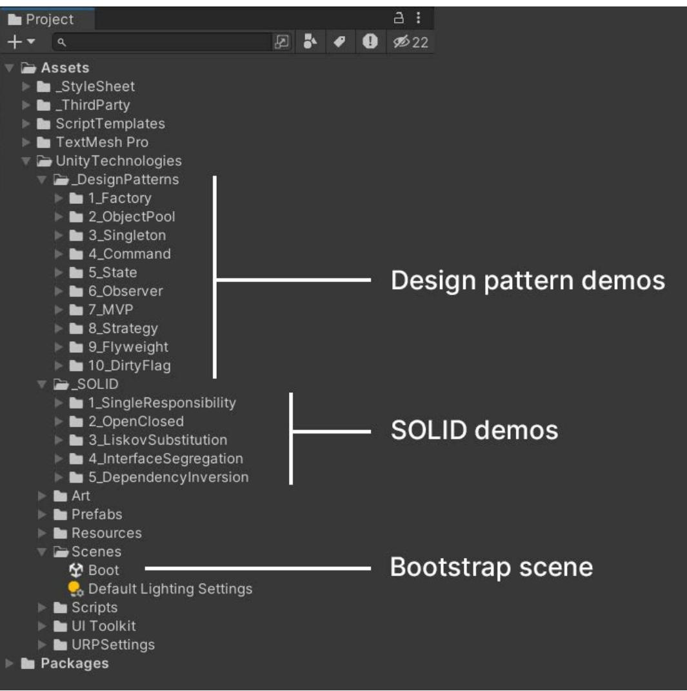

Explore the sample project.

Please note that there may be minor differences between the sample project and the code examples in this guide. To enhance clarity and readability, some examples feature simplified code, (e.g., public fields).

Your team might prefer a coding style different from the conventions used in this guide or the sample project. We recommend creating a C# style guide specific to your specific needs and then following it consistently across the team.

For further guidance, refer to our e-book, *[Create a C# style guide: Write cleaner code that](https://unity.com/resources/create-code-c-sharp-style-guide-e-book?ungated=true)  [scales](https://unity.com/resources/create-code-c-sharp-style-guide-e-book?ungated=true)*, which offers some tips on how to adapt, create, and implement code style guidelines.

<span id="page-9-0"></span>

## The SceneBootstrapper

The project features a SceneBootstrapper class designed to streamline the development process when dividing your project into multiple Unity scenes.

The bootstrap logic automatically loads a designated **Boot** scene whenever you enter Play mode as the first thing. For that reason the Boot scene should be listed first in the **File> Build Settings**.

This approach ensures a consistent starting point for the game. Even if you don't have the Boot scene currently opened, entering Play mode will force the project to load from there.

The SceneBootstrapper also tracks the last scene active in the Editor before Play mode is initiated, storing this information in EditorPrefs. After exiting Play mode, it reverts to the last active scene, making it easier to pick up where you left off.

| Services<br>Jobs | DesignPatterns Window<br>Help                   | of and ca<br>C<br>10)       |
|------------------|-------------------------------------------------|-----------------------------|
|                  | MVP - Design Don't Load Bootstrap Scene On Play | review (6000.0.9f1) <Metal> |
|                  | Load Bootstrap Scene On Play                    |                             |
|                  | lools                                           |                             |
| a :              | # Scene - Scene                                 |                             |

Toggle the SceneBootstrapper using the menus.

If you want to explore the scenes individually without the need to go through the Boot scene every time, simply disable the bootstrapper from the Design Patterns menu (**Design Patterns > Don't Load Bootstrap on Play**). Re-enable the bootstrapper through the same menu.

For the application to function correctly, all scenes must be listed in the Build Settings, with the bootstrapper scene positioned at index 0. Otherwise, the IsSceneInBuildSettings method in the example implementation will log an error.

For a more in-depth understanding of how the Bootstrapper works, you can refer to the appendix section. You can also explore the similar bootstrapper from the [QuizU](https://discussions.unity.com/t/welcome-to-the-new-ui-toolkit-sample-project-quizu/308607) project in [this related article](https://discussions.unity.com/t/welcome-to-the-new-ui-toolkit-sample-project-quizu/308607#bootloadscreen-20).

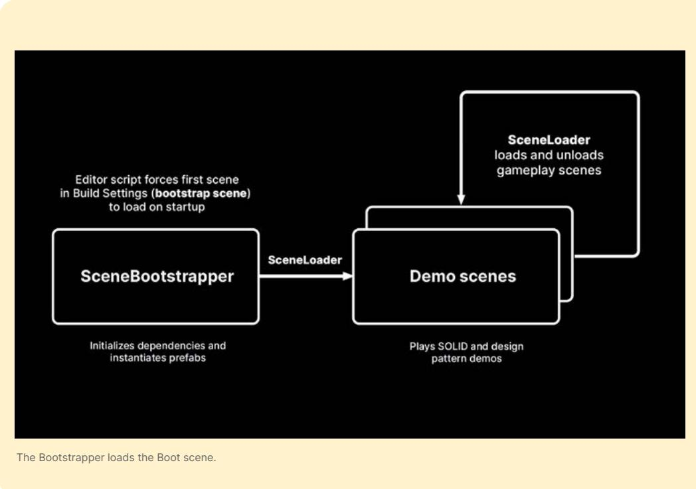

#### **The KISS principle**

When reviewing these examples, remember there isn't a blanket "right way" to approach a problem. The sample code is one solution among many.

When in doubt, filter everything in this guide through the [KISS principle](https://en.wikipedia.org/wiki/KISS_principle): "Keep it simple, stupid." Only add complexity if necessary.

Every design pattern comes with tradeoffs, whether that means additional structures to maintain or more setup at the beginning. Decide if the benefit justifies extra work before implementing it.

If you're unsure if a pattern applies to your specific problem, you might be better off waiting for a situation where it feels like a more natural fit. Don't use a pattern because it's new or novel to you; use it when you need it.

Then, the design pattern will serve its intended purpose: to help you develop better software.

Let's get started.

# <span id="page-11-0"></span>The SOLID principles

SOLID is a [mnemonic acronym](https://en.wikipedia.org/wiki/Mnemonic) for five core fundamentals of software design. You can think of them as five basic rules to keep in mind while coding to keep [object-oriented](https://en.wikipedia.org/wiki/Object-oriented) designs understandable, flexible, and [maintainable.](https://en.wikipedia.org/wiki/Software_maintenance)

Before charging into the patterns themselves, let's look at some design principles that influence how they work.

The five core principles are:

- [Single responsibility](https://en.wikipedia.org/wiki/Single-responsibility_principle)
- [Open-closed](https://en.wikipedia.org/wiki/Open%E2%80%93closed_principle)
- [Liskov substitution](https://en.wikipedia.org/wiki/Liskov_substitution_principle)
- [Interface segregation](https://en.wikipedia.org/wiki/Interface_segregation_principle)
- [Dependency inversion](https://en.wikipedia.org/wiki/Dependency_inversion_principle)

Let's examine each concept and see how they help you make your code more understandable, flexible, and maintainable.

<span id="page-12-0"></span>

### Single-responsibility principle

A class should have one reason to change, just its single responsibility.

The first and most important SOLID principle is the [single-responsibility principle](https://en.wikipedia.org/wiki/Single-responsibility_principle) (SRP), which states that each module, class, or function is responsible for one thing and encapsulates only that part of the logic.

In other words, it states that you should create many smaller classes rather than one monolithic class. Shorter classes and methods are easier to explain, understand, and implement.

If you've worked in Unity for a while, you're likely already familiar with this concept. When you create a GameObject, it holds a variety of smaller components. For example, it might come with:

A MeshFilter that stores a reference to the 3D model

- A Renderer that controls how the model surface appears onscreen
- A Transform component that stores scale, rotation, and position
- A Rigidbody if it needs to interact with the physics simulation

Each component does one thing and does it well. You build an entire scene from GameObjects. The interaction between their components is what makes a game possible.

You'll construct your scripted components in the same way. Design them so each one can be clearly understood. Then have them work in concert to make complex behavior.

If you ignore single responsibility, you might create a custom component that does this:

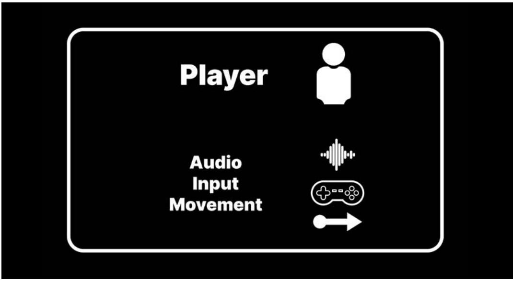

A Player script with multiple responsibilities

```
public class UnrefactoredPlayer : MonoBehaviour
{
 [SerializeField] private string inputAxisName;
 [SerializeField] private float positionMultiplier;
 private float yPosition;
 private AudioSource bounceSfx;
 private void Start()
 {
 bounceSfx = GetComponent<AudioSource>();
 }
 private void Update()
 {
 float delta = Input.GetAxis(inputAxisName) * Time.deltaTime;
 yPosition = Mathf.Clamp(yPosition + delta, -1, 1);
 transform.position = new Vector3(transform.position.x, yPosition * 
 positionMultiplier, transform.position.z);
 }
 private void OnTriggerEnter(Collider other)
 {
 bounceSfx.Play();
 }
}
```
This UnrefactoredPlayer class has a mishmash of responsibilities. It plays a sound when a player collides with something, manages input, and handles movement. Even if the class is relatively short at the moment, it will become tricky to maintain as your project evolves. Consider breaking the Player class into smaller classes.

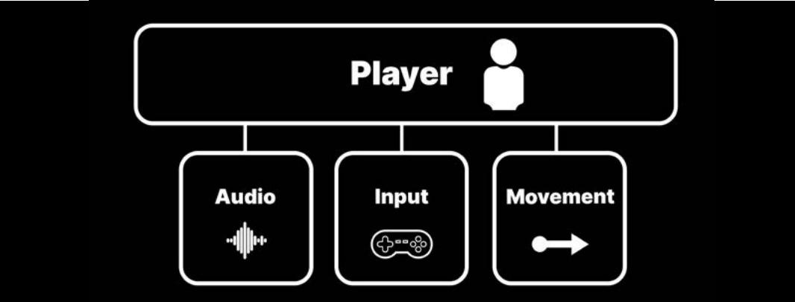

The Player, refactored into classes with single responsibilities

```
[RequireComponent(typeof(PlayerAudio), typeof(PlayerInput), 
typeof(PlayerMovement))]
public class Player : MonoBehaviour
{
 [SerializeField] private PlayerAudio playerAudio;
 [SerializeField] private PlayerInput playerInput;
 [SerializeField] private PlayerMovement playerMovement;
 private void Start()
 {
 playerAudio = GetComponent<PlayerAudio>();
 playerInput = GetComponent<PlayerInput>();
 playerMovement = GetComponent<PlayerMovement>();
 }
}
public class PlayerAudio : MonoBehaviour
{
 …
}
public class PlayerInput : MonoBehaviour
{
 …
}
public class PlayerMovement : MonoBehaviour
{
 …
}
```
A Player script can still manage the other scripted components but each class does only one thing. This design makes it more approachable to revise the code, especially as the requirements for your project change over time.

On the other hand, however, you need to balance the single-responsibility principle with a good dose of common sense. Don't oversimplify to the extreme by creating classes with just one method.


Keep these objectives in mind when working with the single-responsibility principle:

- **Readability:** Short classes are easier to read. There is no hard and fast rule but many developers set a limit of 200-300 lines. Determine for yourself or as a team what constitutes "short." When you exceed this threshold, decide if you can refactor it into smaller parts.
- **Extensibility:** You can inherit from small classes more easily. Modify or replace them without fear of breaking unintended features.
- **Reusability:** Design your classes to be small and modular so that you can reuse them for other parts of your game.

When refactoring, consider how rearranging code will improve the quality of life for yourself or other team members. Some extra effort at the beginning can save you a lot of trouble later.

### Simple is not easy

Simplicity is often talked about in software design and is a prerequisite for reliability. Can your software design handle changes in production? Can you extend and maintain your application over time?

Many of the design patterns and principles presented in this guide help you enforce simplicity. In doing so, they make your code more scalable, flexible, and readable. However, they require some extra work and planning. "Simple" does not equate to "easy."

Though you can create the same functionality without the patterns (and often more quickly), something fast and easy doesn't necessarily result in something simple. Making something simple means making it focused. Design it to do one thing, and don't overcomplicate it with other tasks.

Check out Rich Hickey's lecture, [Simple Made Easy,](https://www.infoq.com/presentations/Simple-Made-Easy/) to understand how simplicity can help you build better software.

<span id="page-16-0"></span>

#### **Example: Sample project**

The sample project includes a simple demo of applying single responsibility principle to a player character. The Player class references other scripts that each handle a specific aspect of player behavior:

- PlayerInput captures and processes player inputs from the keyboard, translating them into a directional vector.
- PlayerMovement controls the player's movement based on the input vector from the PlayerInput class.
- PlayerAudio plays back sound effects when the player collides with obstacles.
- PlayerFX handles particle systems for the player.

Single responsibility makes the codebase more modular and easier to read. It also simplifies the process of updating or extending each component without affecting the others.


The single responsibility demo separates the Player into smaller components.

### Open-closed principle

The [open-closed principle](https://en.wikipedia.org/wiki/Open%E2%80%93closed_principle) (OCP) in SOLID design says that classes must be open for extension but closed for modification. A classic example of this is calculating the area of a shape. Structure your classes so that you can create new behavior without modifying the original code.


In this example, an AreaCalculator class has methods to return the area of a rectangle and circle. For the sake of calculating area, a Rectangle class has a Width and Height. A Circle only needs a Radius and the value of pi.

```
public class AreaCalculator 
{
 public float GetRectangleArea(Rectangle rectangle)
 {
 return rectangle.width * rectangle.height;
 }
 public float GetCircleArea(Circle circle)
 {
 return circle.radius * circle.radius * Mathf.PI;
 }
}
public class Rectangle
{
 public float width;
 public float height;
}
public class Circle
{
 public float radius;
}
```
This works well enough, but if you want to add more shapes to your AreaCalculator, you'll need to create a new method for each new shape. Suppose you want to pass it a pentagon or an octagon later? What if you need 20 more shapes? The AreaCalculator class would quickly balloon out of control.

You could make a base class called Shape and create one method to process the shapes. However, doing so would require multiple if statements inside the logic to handle each type of shape. That won't scale well.

You want to open the program for extension (the ability to use new shapes) without modifying the original code (the internals of the AreaCalculator). Though it's functional, the current AreaCalculator violates the open-closed principle.

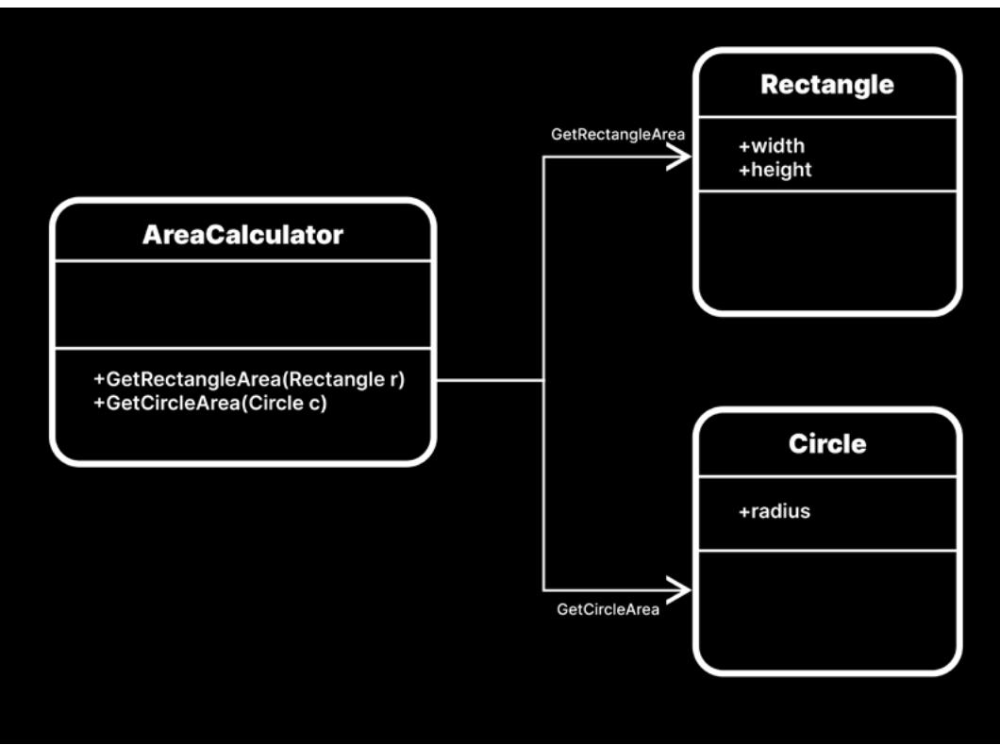

How do we design the AreaCalculator to take new shapes?

Instead, consider defining an abstract Shape class:


This includes an abstract method called CalculateArea. If you then make Rectangle and Circle inherit from Shape, each shape can calculate its own area and return the following result:

```
public class Rectangle : Shape
{
 public float width;
 public float height;
 public override float CalculateArea()
 {
 return width * height;
 }
}
public class Circle : Shape
{
 public float radius;
 public override float CalculateArea()
 {
 return radius * radius * Mathf.PI; 
 }
}
```
The AreaCalculator can simplify into this:


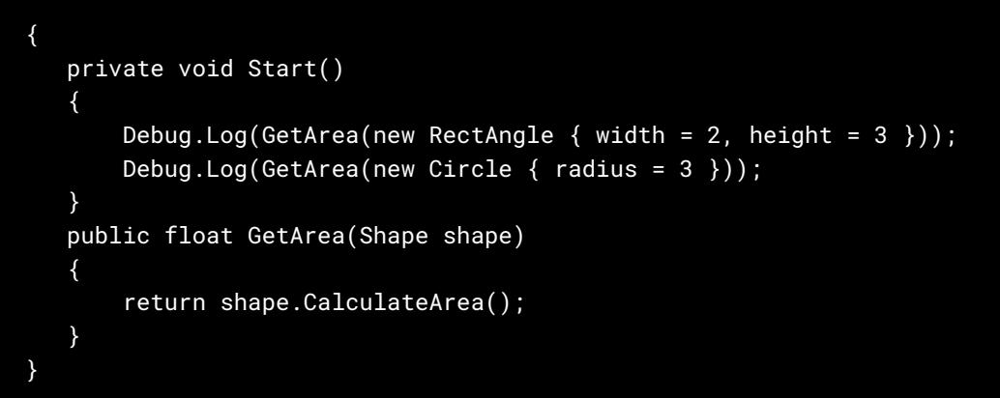

The revised AreaCalculator class can now get the area of any shape that properly implements the abstract Shape class. You can then extend the AreaCalculator functionality without changing any of its original source.

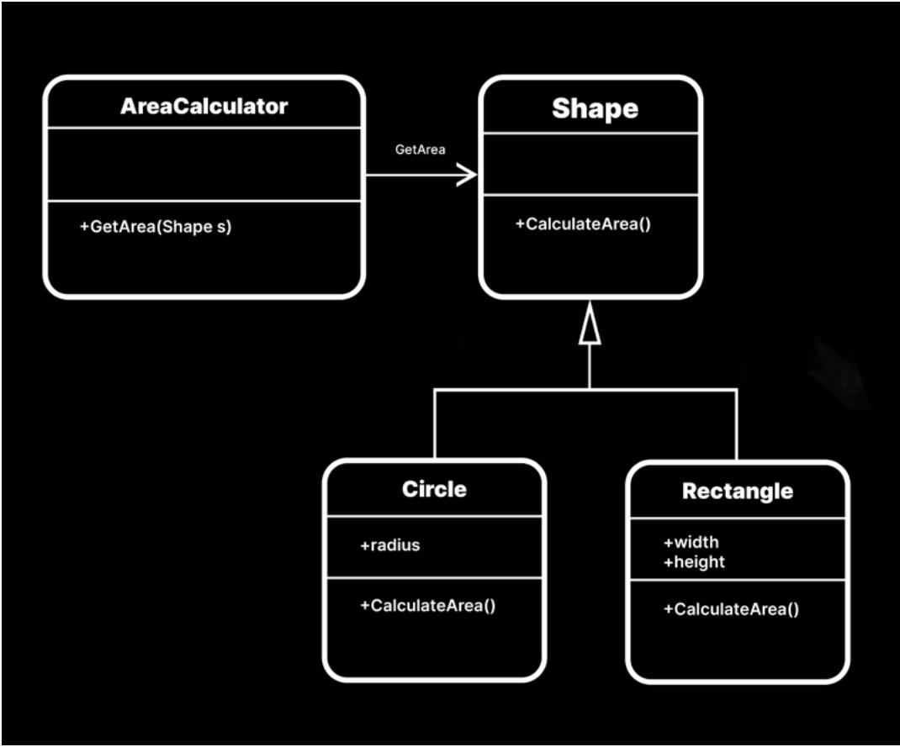

Revising the classes for the open-closed principle

<span id="page-21-0"></span>

Every time you need a new polygon, simply define a new class that inherits from Shape. Each subclassed shape then overrides the CalculateArea method to return the correct area.

This new design makes debugging easier. If a new shape introduces an error, you don't have to revisit the AreaCalculator. The old code remains unchanged, so you only need to examine new code for any faulty logic.

Take advantage of interfaces and abstraction when creating new classes in Unity. This helps to avoid unwieldy switch or if statements in your logic that will be difficult to extend later. Once you get accustomed to setting up your classes to respect OCP, adding new code in the long term becomes simpler.

#### **Example: Sample project**

The sample project shows a similar example of applying the open-closed principle in a simple demo. Here, the abstract base class, AreaOfEffect, introduces an abstract method called CalculateArea.

Derived classes (CircleEffect, HexagonalEffect, RectangleEffect, and TriangularEffect) can implement their unique formulas for calculating the area of effect or playing back a visual effect. Each simply defines its own logic within CalculateArea. Adding new area effect types doesn't alter existing code.

When the player collides with an EffectTrigger component, it interacts with the AreaOfEffect without knowledge of each effect's specific details. Adding new effects thus become more flexible and extensible.

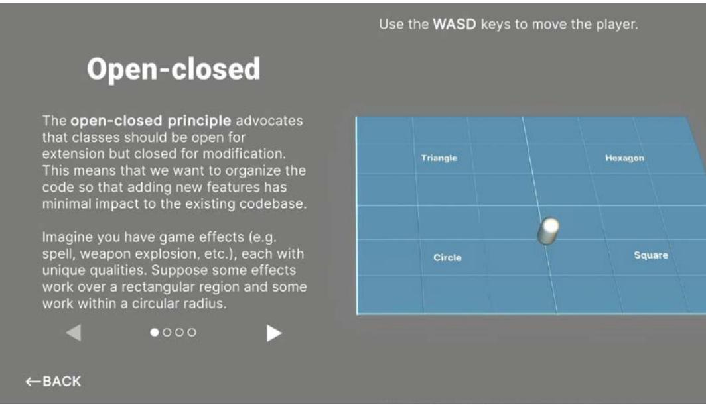

The open-closed principle makes your code more extensible.

### <span id="page-22-0"></span>Liskov substitution principle

The Liskov substitution principle (LSP) states that derived classes must be substitutable for their base class. Inheritance in object-oriented programming allows you to add functionality through subclasses. However, this can lead to unnecessary complexity if you're not careful.

The Liskov substitution principle, the third pillar of SOLID, tells you how to apply inheritance to make your subclasses more robust and flexible.

Imagine your game requires a class called Vehicle. This will be the base class of a vehicle subclass that you will create for your application. For example, you might need a car or truck.


Everything inherits from Vehicle.

Everywhere you can use the base class (Vehicle), you should be able to use a subclass like Car or Truck without breaking the application.


Your Vehicle class might look like this:

```
public class Vehicle
{
 public float speed = 100;
 public Vector3 direction;
 public void GoForward()
 {
 ...
 }
 public void Reverse()
 {
 ...
 }
 public void TurnRight()
 {
 ...
 }
 public void TurnLeft()
 {
 ...
 }
}
```


Suppose you are building a turn-based game where you move the vehicles around a board.

An example game of cars versus trains

You could have another class called Navigator to steer a vehicle along a prescribed path:

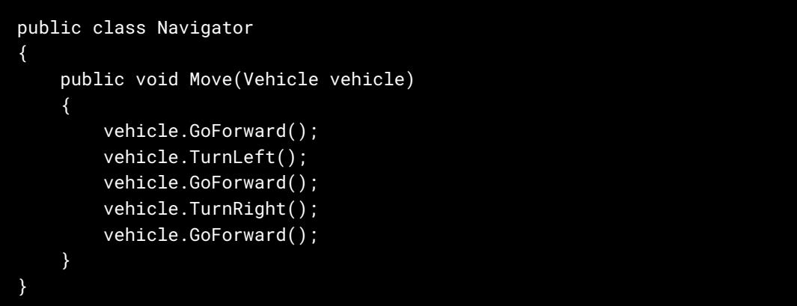

With this class, you expect to be able to pass any vehicle into the Navigator's Move method, and this will work fine with cars and trucks. What happens, though, when you want to implement a class called Train?

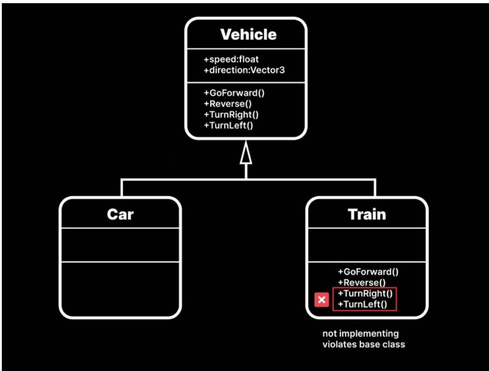

A Train would violate your base class.

The TurnLeft and TurnRight methods would not work in a Train class since a train can't leave its tracks. If you do pass a train into the Navigator's Move method, that would throw an unimplemented Exception (or do nothing) when you get to those lines. You violate the Liskov substitution principle if you cannot substitute a type for its subtype.

Since a Train is a subtype of Vehicle, you would expect to use it any place that accepts the Vehicle class. Doing otherwise might make your code behave unpredictably.

Consider some tips to adhere more closely to Liskov substitution principle:

- **If you are removing features when subclassing, you are likely breaking Liskov substitution:** A NotImplementedException is a dead giveaway that you've violated this principle. Leaving a method blank does so as well. If the subclass does not behave like the base class, you're not following LSP – even if there's no explicit error or exception.
- **Keep abstractions simple:** The more logic you put into the base class the more likely you will break LSP. The base class should only express the common functionality of the derived subclasses.


- **A subclass needs to have the same public members as the base class:** Those members also need to have the same signatures and behavior when calling them.
- **Consider the class API before establishing class hierarchies:** Even though you think of them all as vehicles, it might make more sense for a Car and Train to inherit from separate parent classes. Classifications in reality don't always translate into class hierarchy.
- **Favor composition over inheritance:** Instead of trying to pass functionality through inheritance, create an interface or separate class to encapsulate a specific behavior. Then build up a "composition" of different functionality by mixing and matching.

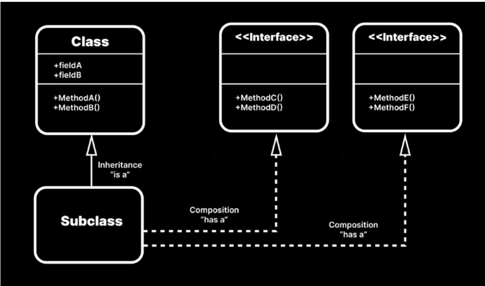

Composition over inheritance

To fix this design, scrap the original Vehicle type, then move much of the functionality into interfaces:

```
public interface ITurnable 
{
 public void TurnRight();
 public void TurnLeft();
}
public interface IMovable
{
 public void GoForward();
 public void Reverse();
}
```
Follow the LSP principle more closely by creating a RoadVehicle type and RailVehicle type. The Car and Train would then inherit from their respective base classes.

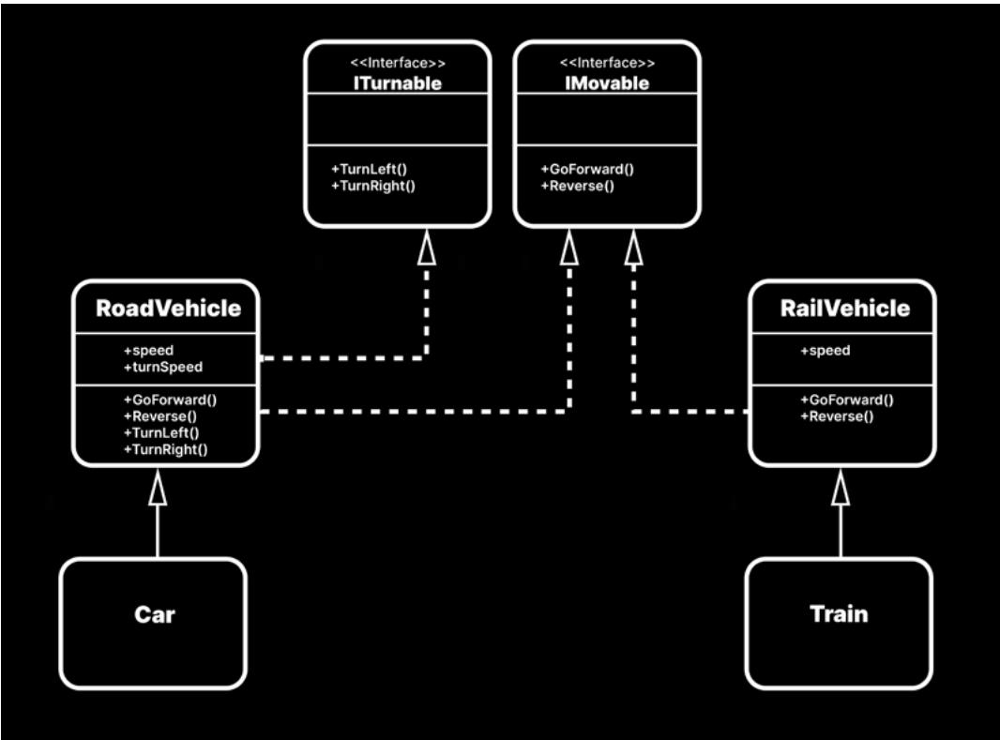

Refactoring to take Liskov substitution into consideration


```
public class RoadVehicle : IMovable, ITurnable
{
 public float speed = 100f;
 public float turnSpeed = 5f;
 public virtual void GoForward()
 {
 ...
 }
 public virtual void Reverse()
 {
 ... 
 }
 public virtual void TurnLeft()
 {
 ... 
 }
 public virtual void TurnRight()
 {
 ... 
 }
}
public class RailVehicle : IMovable
{
 public float speed = 100;
 public virtual void GoForward()
 {
 ...
 }
 public virtual void Reverse()
 {
 ...
 }
}
public class Car : RoadVehicle
{
 ...
}
public class Train : RailVehicle
{
 ...
}
```
<span id="page-29-0"></span>

In this way the functionality comes through interfaces rather than inheritance. Car and Train no longer share the same base class, which now satisfies LSP. Though you could derive RoadVehicle and RailVehicle from the same base class, there is not much need to in this case.

This way of thinking can be counterintuitive because you have certain assumptions about the real world. In software development, this is called the [circle–ellipse problem](https://en.wikipedia.org/wiki/Circle%E2%80%93ellipse_problem). Not every actual "is a" relationship translates into inheritance. Remember, you want your software design to drive your class hierarchy, not your prior knowledge of reality.

Follow the Liskov substitution principle to limit how you use inheritance to keep your codebase extendable and flexible.

#### **Example: Sample project**

The sample project demonstrates the Liskov substitution principle through a set of power ups. The PowerUp abstract class serves as the base class for example player buffs (including an InvulnerabilityPowerUp, HealthBoost, and SpeedBoost). Each subclass overrides the ApplyEffect method to implement specific logic.

Liskov substitution allows any instance of PowerUp to be replaced with instances of its subclasses. This ensures that the game works correctly regardless of the specific type of power-up encountered.

The result is code reusability and maintainability. Reinforcing the open-closed principle, adding new types of power-ups in the future won't necessitate modifying existing code.

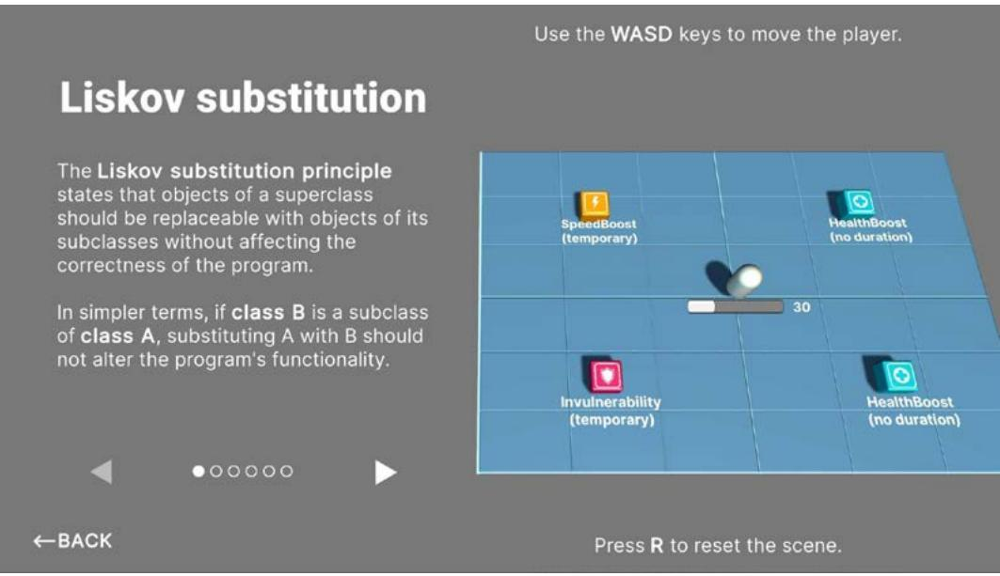

In Liskov substitution, objects of a subclass can always replace objects of a base class.

<span id="page-30-0"></span>

#### Interface segregation principle

The [interface-segregation principle](https://en.wikipedia.org/wiki/Interface_segregation_principle) (ISP) states that no client should be forced to depend on methods it does not use.

In other words, avoid large interfaces. Follow the same idea as the single-responsibility principle, which tells you to keep classes and methods short. This gives you maximum flexibility, keeping interfaces compact and focused.

Imagine you're making a strategy game with different player units. Each unit has different stats like health and speed. You might want to make an interface to guarantee that all of the units implement similar features:

```
public interface IUnitStats 
{
 public float Health { get; set; }
 public int Defense { get; set; }
 public void Die();
 public void TakeDamage();
 public void RestoreHealth();
 public float MoveSpeed { get; set; }
 public float Acceleration { get; set; }
 public void GoForward();
 public void Reverse();
 public void TurnLeft();
 public void TurnRight();
 public int Strength { get; set; }
 public int Dexterity { get; set; }
 public int Endurance { get; set; }
}
```
Let's say you want to make a destructible prop like a breakable barrel or crate. This prop will also need the concept of health despite not moving. A crate or barrel also won't have many of the abilities associated with other units in the game.

Split it into several smaller interfaces rather than make one interface that gives the breakable prop too many methods. A class implementing them will then only mix and match what it needs.

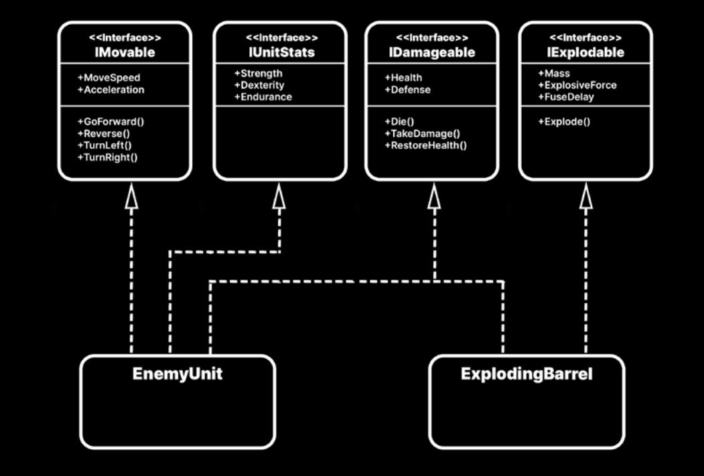

Split the interface into smaller ones.

```
public interface IMovable
{
 public float MoveSpeed { get; set; }
 public float Acceleration { get; set; }
 public void GoForward();
 public void Reverse();
 public void TurnLeft();
 public void TurnRight();
}
public interface IDamageable 
{
 public float Health { get; set; }
 public int Defense { get; set; }
 public void Die();
 public void TakeDamage();
 public void RestoreHealth();
}
public interface IUnitStats 
{
 public int Strength { get; set; }
 public int Dexterity { get; set; }
 public int Endurance { get; set; }
}
```
<span id="page-32-0"></span>

You can also add an IExplodable interface for the exploding barrel:

```
public interface IExplodable 
{
 public float Mass { get; set; }
 public float ExplosiveForce { get; set; }
 public float FuseDelay { get; set; }
 public void Explode();
}
```
Because a class can implement more than one interface, you can compose an enemy unit from IDamageable, IMoveable, and IUnitStats.

An exploding barrel could use IDamageable and IExplodable without needing the unnecessary overhead of the other interfaces.


#### **Example: Sample project**

The sample project demonstrates the interface segregation through a set of target objects. Aim the gun with the mouse and shoot with the left mouse button.

Each target only implements the methods that it needs. By defining smaller, more focused interfaces (such as IEffectTrigger, IExplodable, and IDamageable), each class only implements the functionalities that are relevant. This reduces unnecessary dependencies between classes and interfaces.

- IEffectTrigger allows objects to trigger visual or audio effects at a specific location. In this case, the projectile shows a small hit effect on collision.
- IDamageable allows an object to take damage. A target with a HealthBar attached disappears when its health runs out.
- IExplodable instantiates an explosion prefab when the target dies.

<span id="page-33-0"></span>This segregation of interfaces allows for greater flexibility in how objects interact within the game environment. For example, in this way, the Projectile class can then affect other objects without direct knowledge of each target's specific implementation.

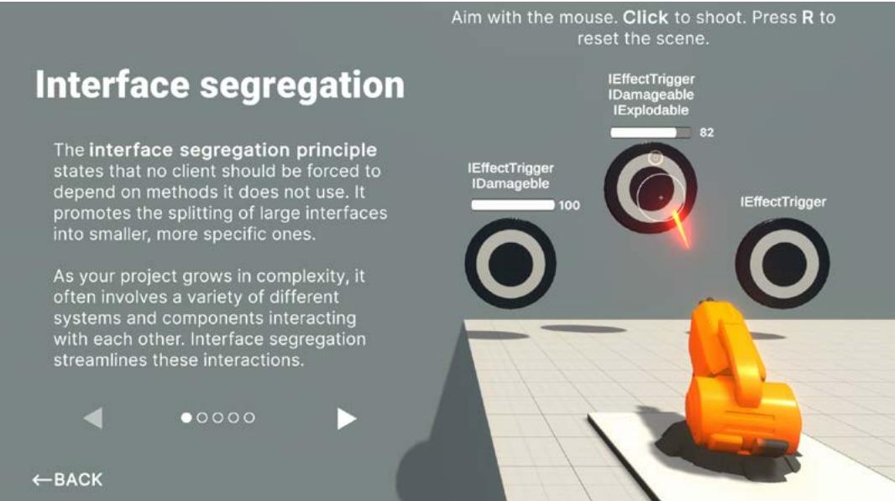

Interface segregation says that no client should depend on methods it doesn't use.

## Serializing interfaces

Even if you apply the SerializeField attribute to an interface-type field, or make it public, the field won't display in the Inspector. Unity's serialization system is designed to work with concrete classes, especially those inheriting from MonoBehaviour or ScriptableObject.

Interfaces, which are abstract by nature, do not hold concrete data themselves and hence fall outside the direct scope of the serialization mechanism. To work around this limitation:

- Instead of trying to serialize the interface, serialize a reference to a concrete object (e.g. MonoBehaviour or ScriptableObject) that implements the interface.
- At runtime, use the is keyword to check and cast the serialized object. Then, you can verify if it implements the required interface.

```
Here's an example:
   // Define an interface
  public interface IInteractable
  {
   void Interact();
  }
  // Concrete class implementing the interface
  public class DoorController : MonoBehaviour, IInteractable
  {
   public void Interact()
   {
   // Door logic here
   Debug.Log("Door opened");
   }
  }
  public class GameManager : MonoBehaviour
  {
   [SerializeField]
   private MonoBehaviour interactableObject;
   private void Start()
   {
   // Check and cast at runtime
   if (interactableObject is IInteractable interactable)
   {
   interactable.Interact();
   }
   }
  }
```
Again, this favors [composition over inheritance](https://en.wikipedia.org/wiki/Composition_over_inheritance), similar to the example with Liskov substitution. The interface segregation principle helps decouple your systems and makes them easier to modify and extend.

<span id="page-35-0"></span>

### Dependency inversion principle

The [dependency inversion principle](https://en.wikipedia.org/wiki/Dependency_inversion_principle) (DIP) says that high-level modules should not import anything directly from low-level modules. Both should depend on abstractions.

Let's unpack what that means. When one class has a relationship with another, it has a [dependency or coupling.](https://en.wikipedia.org/wiki/Coupling_(computer_programming)) Each dependency in software design carries some risk.

If one class knows too much about how another class works, modifying the first class can damage the second or vice versa. A high degree of coupling is considered unclean code practice. An error in one part of the application can snowball into many.

Ideally, aim for as few dependencies between classes as possible. Each class also needs its internal parts to work together in unison, rather than relying on connections to the outside. Your object is considered cohesive when it functions on internal or private logic.


In the best scenario, aim for loose coupling and high cohesion.

Strive for loose coupling with high cohesion.

You need to be able to modify and expand your game application. If it's fragile and resistant to modification, investigate how it's currently structured.

The dependency inversion principle can help reduce this tight coupling between classes. When building classes and systems in your application, some are naturally "high-level" and some "low-level". A high-level class depends on a lower-level class to get something done. SOLID tells us to switch this up.

Suppose you are making a game where a character explores the level and triggers a door to open. You might want to create a class called Switch and another class called Door.


The Switch (high-level) depends directly on the Door (low-level) class.

On a high-level, you want the character to move to a specific location and for something to happen. The Switch will be responsible for that.

On a low-level is another class, Door, that contains the actual implementation of how to open the door geometry. For simplification, a Debug.Log statement is added to represent the logic of the opening and closing door.

```
public class Switch : MonoBehaviour
{
 public Door door;
 public bool isActivated;
 public void Toggle()
 {
 if (isActivated)
 {
 isActivated = false;
 door.Close();
 }
 else
 {
 isActivated = true;
 door.Open();
 }
 }
}
public class Door : MonoBehaviour
{
 public void Open()
 {
 Debug.Log("The door is open.");
 }
 public void Close()
 {
 Debug.Log("The door is closed.");
 }
}
```
Switch can invoke the Toggle method to open and close the door. It works, but the problem is that a dependency is wired from the Door directly into the Switch. What if the logic of the Switch needs to work on more than just a Door for example, to activate a light or giant robot?

You can add extra methods into the Switch class, but you'd be violating the open-closed principle. You have to modify the original code every time you want to extend functionality.

Once again abstractions come to the rescue. You can sandwich an interface called ISwitchable in between your classes.


An interface, ISwitchable, between the two classes

ISwitchable just needs a public property so you know whether it's active, plus a couple of methods to Activate and Deactivate it.

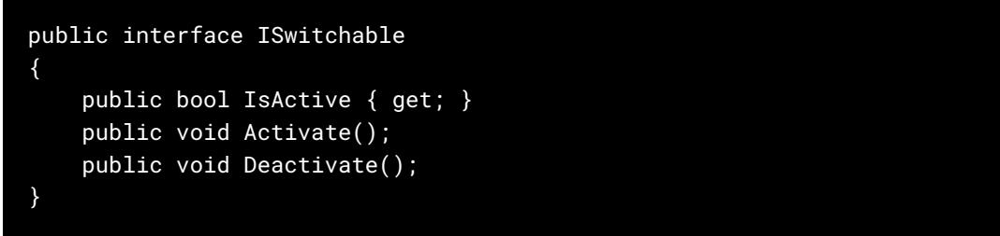

Then the Switch becomes something like this, depending on an ISwitchable client, instead of a door directly.

```
public class Switch : MonoBehaviour
{
 public ISwitchable client;
 public void Toggle()
 {
 if (client.IsActive)
 {
 client.Deactivate();
 }
 else
 {
 client.Activate();
 }
 }
}
```
On the other hand, you'll need to rework the Door to implement ISwitchable:

```
public class Door : MonoBehaviour, ISwitchable
{
 private bool isActive;
 public bool IsActive => isActive;
 public void Activate()
 {
 isActive = true;
 Debug.Log("The door is open.");
 }
 public void Deactivate()
 {
 isActive = false;
 Debug.Log("The door is closed.");
 }
}
```
Now you've inverted the dependency. The interface creates an abstraction in between them rather than hardwiring the switch to the door exclusively. The Switch no longer depends directly on the door-specific methods (Open and Close). Instead it uses the ISwitchable's Activate and Deactivate.

<span id="page-40-0"></span>This small but significant change promotes reusability. Whereas Switch would only work with a Door previously, now it works with anything that implements ISwitchable.

This enables you to make more classes that the Switch can activate. The high-level Switch will work, whether it's a trap door or a laser beam. It just needs a compatible client that implements ISwitchable.

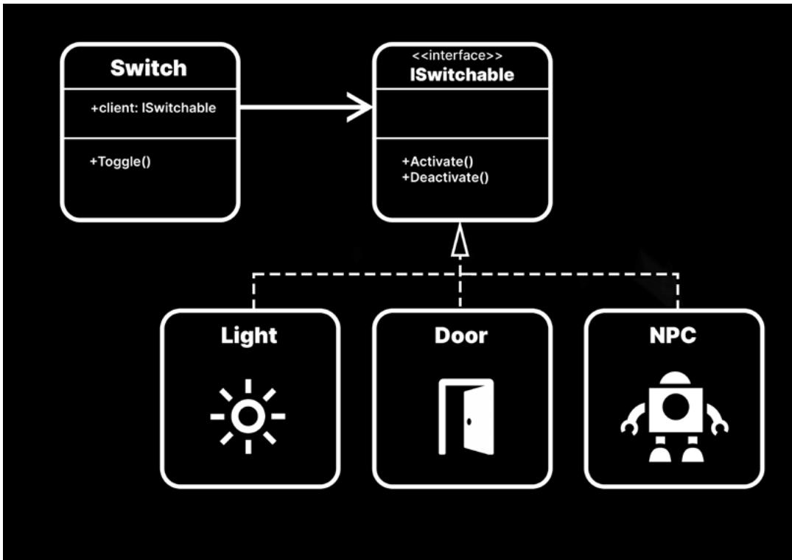

The Switch can now activate any ISwitchable object.

Like the rest of SOLID, the dependency inversion principle asks you to examine how you normally set up relationships between your classes. Conveniently scale your project with loose coupling.

#### **Example: Sample project**

The sample project showcases dependency inversion with an implementation of a door and trap example. Click each respective switch to activate the device in question. Remember that high-level modules (like the switch) should not depend on low-level modules (like the door or trap).

Instead, the ISwitchable interface acts as an abstraction layer between them. It defines a contract for activating or deactivating objects, regardless of their specific implementations.

The Door and Trap classes implement the ISwitchable interface. This allows them to be controlled by other parts of the system without direct knowledge of their concrete behaviors.

Thus, the Door can manage the mechanics of opening and closing, while the Trap can handle activation and deactivation logic, all under the same interface.

By depending on an abstraction rather than concrete implementations, the system can easily be extended with new types of switchable objects.

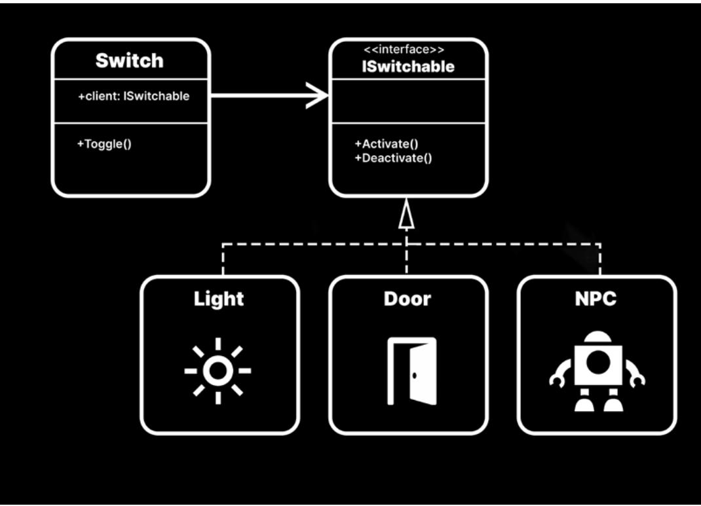

In dependency inversion, high-level modules should not depend on low-level modules. Both depend on abstractions.

<span id="page-42-0"></span>

## Interfaces versus abstract classes

In keeping with the philosophy of favoring "composition over inheritance," many examples in this guide use interfaces. However, you can follow many of the design principles and patterns with abstract classes as well.

Both are valid ways to achieve abstractions in C#. Which one you use depends on your situational needs.

#### **Abstract classes**

The abstract keyword lets you define a base class, so you can pass common functionality (methods, fields, constants, etc.) to subclasses through inheritance.

You can't instantiate an abstract class directly. Instead you'll need to derive a concrete class.

In the preceding example, an abstract class could achieve the same dependency inversion, just with a different approach. So rather than use an interface, derive a concrete class (e.g., Light or Door) from an abstract class called Switchable.

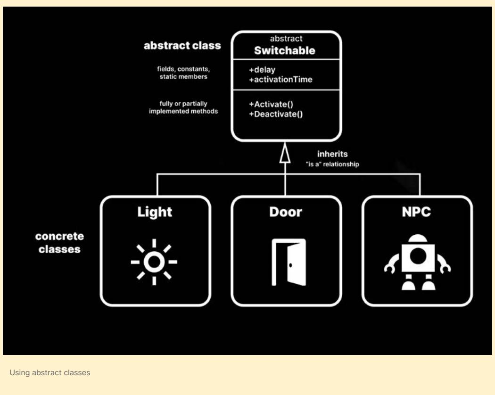

Inheritance defines an "is a" relationship. Shown in the diagram above are all "switchable" things that can turn on and off.

The advantage of abstract classes is they can have fields and constants as well as static members. They can also apply more restricted access modifiers, like protected and private. Unlike interfaces, abstract classes let you implement logic that enables you to share core functionality between your concrete classes.

Inheritance works well until you want to create a derived class that has characteristics of two different base classes. In C#, you can't inherit from more than one base class.


Choosing between base classes

If you had another abstract class for all Robots in your game, then it's harder to decide what to derive from. Do you use the Robot or Switchable base class?

<span id="page-44-0"></span>

#### **Interfaces**

As seen in the interface segregation principle, interfaces give you more flexibility when something doesn't fit neatly into the paradigm of inheritance. You can pick and choose more easily with a "has a" relationship.

However, interfaces only contain declarations of their members. A class that actually implements the interface will be responsible for fleshing out the specific logic.

Thus, it's not always an either-or decision. Use abstract classes to define the base functionality where you want to share code. Use interfaces to define peripheral abilities where you need flexibility.

In this example, you can derive the NPC from the Robot base class to inherit its core features, but then use an interface ISwitchable to add the ability to switch the NPC on and off.


Keep in mind the following differences between abstract classes and interfaces:

| Abstract class                                          | Interface                                                         |
|---------------------------------------------------------|-------------------------------------------------------------------|
| Fully or partially implements methods                   | Declares methods but can't implement them                         |
| Declares/uses variables and fields                      | Declares only methods and properties<br>(but not fields)          |
| Has static members                                      | Can't declare/use static members                                  |
| Uses constructors                                       | Can't use constructors                                            |
| Uses all access modifiers (protected,<br>private, etc.) | Can't use access modifiers<br>(all members are implicitly public) |

Remember: A class can inherit from at most one abstract class, but it can implement multiple interfaces.

<span id="page-46-0"></span>

### A SOLID understanding

Getting to know the SOLID principles is a matter of daily practice. Think of them as five basic rules to always keep in mind while coding. Here's a handy recap:

- **Single responsibility:** Make sure classes only do one thing and have only one reason to change.
- **Open-closed:** You should be able to extend the functionality of a class without changing how it already works.
- **Liskov substitution:** Subclasses should be substitutable for their base classes.
- **Interface segregation:** Keep your interfaces short with few methods. Clients only implement what they need.
- **Dependency inversion:** Depend on abstractions. Don't depend directly from one concrete class to another.

The SOLID principles are guidelines to help you write cleaner code so that it's more efficient to maintain and extend. SOLID principles have dominated software design for nearly two decades at the enterprise level because they're well-suited for large applications that must scale.

In some cases, adhering to SOLID can result in additional work up front. You might need to refactor some of your functionality into abstractions or interfaces. However, there is often a payoff in long-term savings.

Determine for yourself how strictly you will apply the principles to your projects; they're not absolutes. There are nuances, and numerous ways to implement each one that are not covered here. Remember: the thinking behind the principle is more important than any specific syntax.

When unsure about how to use them, refer back to the KISS principle. Keep it simple, and don't try to force the principles into your scripts just for the sake of doing it. Let them organically work themselves into place through necessity.

For more information, be sure to check out the [Unity SOLID presentation](https://www.youtube.com/watch?v=eIf3-aDTOOA?utm_source=demand-gen&utm_medium=pdf&utm_campaign=clean-code&utm_content=game-programming-patterns-ebook) from Unite Austin.

# <span id="page-47-0"></span>Design patterns for game development

Once you understand the SOLID principles, you'll want to dive deeper into design patterns.

Design patterns let you repurpose well-known solutions for everyday software problems. A pattern, however, isn't an off-the-shelf library or framework. Nor is it an algorithm, which is a specific set of steps to achieve a result.

Instead, think of a design pattern more like a blueprint. It's a general plan that leaves the actual construction up to you. Two programs can follow the same pattern but have very different code.

When developers encounter the same problem in the wild, many of them will inevitably come up with similar solutions. Once such a solution becomes repeated enough, someone might "discover" a pattern and formally give it a name.

### The Gang of Four

Many of today's software design patterns stem from the seminal work, *Design Patterns: Elements of Reusable Object-Oriented Software* by Erich Gamma, Richard Helm, Ralph Johnson, and John Vlissides. This book describes 23 such patterns identified in a variety of day-to-day applications.

The original authors are often referred to as the "Gang of Four" (GoF), and you'll also hear the original patterns dubbed the GoF patterns. While the examples cited are mostly in C++ (and Smalltalk), you can apply their ideas to any object-oriented language, such as C#.

<span id="page-48-0"></span>

Since the Gang of Four originally published *Design Patterns* in 1994, developers have discovered dozens more object-oriented patterns in a variety of fields. Many engineering specialities have well-established patterns. Game development is no different.

#### Learning design patterns

While you can work as a game programmer without studying design patterns, learning them will only help you become a better developer. After all, design patterns are labeled as such because they're common solutions to well-known problems.

Software engineers rediscover them all the time in the normal course of development. You may have already implemented some of these patterns unwittingly.

Train yourself to look for them. Doing this can help you:

- **Learn object-oriented programming:** Design patterns aren't secrets buried in an esoteric StackOverflow post. They are common ways to overcome everyday hurdles in development. They can inform you how many other developers approached the same issue. Remember, even if you aren't using patterns, someone else is.
- **Talk to other developers:** Patterns can serve as a shorthand when trying to communicate as a team. Mention the "command pattern" or "object pool" and experienced Unity developers will know exactly what you're trying to implement.
- **Explore new frameworks:** When you import a built-in package or something from the Asset Store, inevitably you'll stumble onto one or more patterns discussed here. Recognizing design patterns will help you understand how a new framework works and the thought process involved in its creation.

Of course, not all design patterns apply to every game application. Don't go looking for them with [Maslow's hammer](https://en.wikipedia.org/wiki/Law_of_the_instrument); otherwise, you might only find nails.

Like any other tool, a design pattern's usefulness depends on context. Each one provides a benefit in certain situations and also comes with its share of drawbacks. Every decision in software development comes with compromises.

Are you generating a lot of GameObjects on the fly? Does it impact your performance? Can restructuring your code fix that?

Be aware of these design patterns and when the time is right, pull them from your gamedev bag of tricks to solve the problem at hand.

## <span id="page-49-0"></span>Further reading

In addition to the Gang of Four's *[Design Patterns: Elements of Reusable Object-Oriented](https://en.wikipedia.org/wiki/Design_Patterns)  [Software](https://en.wikipedia.org/wiki/Design_Patterns)*, another standout volume is *[Game Programming Patterns](https://gameprogrammingpatterns.com)* by Robert Nystrom. The author details a variety of software patterns in a no-nonsense manner. The webbased edition is available for free at [gameprogrammingpatterns.com.](https://gameprogrammingpatterns.com)

#### Patterns within Unity

Unity already implements several established gamedev patterns, saving you the trouble of writing them yourself. These include:

— **Game loop and update**: At the core of all games is an infinite loop that must function independently of clock speed, since the hardware that powers a game application can vary greatly. To account for computers of different speeds, game developers often need to use a fixed timestep (with a set frames-per-second) and a variable timestep where the engine measures how much time has passed since the previous frame.

Unity takes care of this out of the box, so you don't have to implement it yourself. You only need to manage gameplay using MonoBehaviour methods like Update, LateUpdate, and FixedUpdate. Then, you can modify GameObjects and components for each frame of the game clock.

— **Prototype:** Often you need to copy objects without affecting the original. This creational pattern solves the problem of duplicating and cloning an object to make other objects similar to itself. This way you avoid defining a separate class to spawn every type of object in your game.

Unity's [Prefab system](https://docs.unity3d.com/6000.0/Documentation/Manual/Prefabs.html?utm_source=demand-gen&utm_medium=pdf&utm_campaign=clean-code&utm_content=game-programming-patterns-ebook) implements a form of prototyping for GameObjects. This allows you to duplicate a template object complete with its components. Override specific properties to create [Prefab Variants](https://docs.unity3d.com/6000.0/Documentation/Manual/PrefabVariants.html?utm_source=demand-gen&utm_medium=pdf&utm_campaign=clean-code&utm_content=game-programming-patterns-ebook) or [nest Prefabs](https://docs.unity3d.com/6000.0/Documentation/Manual/NestedPrefabs.html?utm_source=demand-gen&utm_medium=pdf&utm_campaign=clean-code&utm_content=game-programming-patterns-ebook) inside other Prefabs to create hierarchies. Use a special [Prefab editing mode](https://docs.unity3d.com/6000.0/Documentation/Manual/EditingInPrefabMode.html?utm_source=demand-gen&utm_medium=pdf&utm_campaign=clean-code&utm_content=game-programming-patterns-ebook) to edit Prefabs in isolation or in context.

— **Component:** Most people working in Unity know this pattern. Instead of creating large classes with multiple responsibilities, build smaller components that each do one thing.

If you use composition to pick and choose components, you combine them for complex behavior. Add Rigidbody and Collider components for physics. Add a MeshFilter and MeshRenderer for 3D geometry. Each GameObject is only as rich and unique as its collection of components.

Of course, Unity can't do everything for you. Inevitably you'll need other patterns that aren't built-in. Let's explore a few of these in the next chapters.

# <span id="page-50-0"></span>Factory pattern


A factory can spawn one or more products.

Sometimes it's helpful to have a special object that creates other objects. Many games spawn a variety of things over the course of gameplay, and you often don't know what you need at runtime until you actually need it.

<span id="page-51-0"></span>

The factory pattern designates a special object called – you guessed it – a factory for this purpose. On one level, it encapsulates many of the details involved in spawning its "products." The immediate benefit is to declutter your code.

However, if each product follows a common interface or base class, you can take this a step further and make it contain more of its own construction logic, hiding it away from the factory itself. Creating new objects thus becomes more extensible.

You can also subclass the factory to make multiple factories dedicated to specific products. Doing this helps generate enemies, obstacles, or anything else at runtime.

#### Example: A simple factory

Imagine you want to create a factory pattern to instantiate items for a game level. You can use Prefabs to create GameObjects, but you might also want to run some custom behavior when creating each instance.

Rather than using if statements or a switch to maintain this logic, create an interface called IProduct and an abstract class called Factory:

```
public interface IProduct
{
 public string ProductName { get; set; }
 public void Initialize();
}
public abstract class Factory : MonoBehaviour
{
 public abstract IProduct GetProduct(Vector3 position);
 // shared method with all factories
 …
}
```
Products need to follow a specific template for their methods, but they don't otherwise share any functionality. Hence, you define the IProduct interface.

Factories might need some shared common functionality, so this sample uses abstract classes. Just be mindful of Liskov substitution from the SOLID principles when using subclasses.


#### They can result in a structure like this:


Using an interface to define shared properties and logic between your products

The IProduct interface defines what is common between your products. In this case, you simply have a ProductName property and any logic the product runs on Initialize.

You can then define as many products as you need (ProductA, ProductB, etc.) so long as they follow the IProduct interface.

The base class, Factory, has a GetProduct method that returns an IProduct. It's abstract, so you can't make instances of Factory directly. You derive a couple of concrete subclasses (ConcreteFactoryA and ConcreteFactoryB), which will actually get the different products.

GetProduct in this example takes a Vector3 position so that you can instantiate a Prefab GameObject more easily at a specific location. A field in each concrete factory also stores the corresponding template Prefab.


Here's the sample ProductA and ConcreteFactoryA.

```
public class ProductA : MonoBehaviour, IProduct
{
 [SerializeField] private string productName = "ProductA";
 public string ProductName { get => productName; set => productName
 = value ; }
 private ParticleSystem particleSystem;
 public void Initialize()
 {
 // any unique logic to this product
 gameObject.name = productName;
 particleSystem = GetComponentInChildren<ParticleSystem>();
 particleSystem?.Stop();
 particleSystem?.Play();
 }
}
public class ConcreteFactoryA : Factory
{
 [SerializeField] private ProductA productPrefab;
 public override IProduct GetProduct(Vector3 position)
 {
 // create a Prefab instance and get the product component
 GameObject instance = Instantiate(productPrefab.gameObject,
 position, Quaternion.identity);
 ProductA newProduct = instance.GetComponent<ProductA>();
 // each product contains its own logic
 newProduct.Initialize();
 return newProduct;
 }
}
```
Here, you've made the product classes MonoBehaviours that implement IProduct take advantage of Prefabs in the factory.

<span id="page-54-0"></span>

Note how each product can have its own version of Initialize. The example ProductA Prefab contains a ParticleSystem, which plays when the ConcreteFactoryA instantiates a copy. The factory itself does not contain any specific logic for triggering the particles; it only invokes the Initialize method, which is common to all products.

Explore the sample project to see how the ClickToCreate component switches between factories to create ProductA and ProductB, which have different behaviors. ProductB plays a sound when it spawns, while ProductA sets off a particle effect.

#### Pros and cons

You'll benefit the most from the factory pattern when setting up many products. Defining new product types in your application doesn't change your existing ones or require you to modify previous code.

Separating each product's internal logic into its own class keeps the factory code relatively short. Each factory only knows to invoke Initialize on each product without being privy to the underlying details.

The downside is that you create a number of classes and subclasses to implement the pattern. Like the other patterns, this introduces a bit of overhead, which may be unnecessary if you don't have a large variety of products.


One product plays a sound, while another plays particles. Both use the same interface.

### <span id="page-55-0"></span>Improvements

The implementation of the factory pattern can vary widely from what's shown here. Consider the following adjustments when building your own factory pattern:

- **Use a dictionary to search for products:** You might want to store your products as key-value pairs in a dictionary. Use a unique string identifier (e.g., the Name or some ID) as the key and the type as a value. This can make retrieving products and/or their corresponding factories more convenient.
- **Make the factory (or a factory manager) static:** This makes it easier to use but requires additional setup. Static classes won't appear in the Inspector, so you will need to make your collection of products static as well.
- **Apply it to non-GameObjects and non-MonoBehaviours:** Don't limit yourself to Prefabs or other Unity-specific components. The factory pattern can work with any C# object.
- **Combine with the object pool pattern:** Factories don't necessarily need to instantiate or create new objects. They can also retrieve existing ones in the hierarchy. If you are instantiating many objects at once, (e.g., projectiles from a weapon), use the object pool pattern for more optimized memory management.

Factories can spawn any gameplay element on an as-needed basis. Note, however, that creating products is often not their only purpose. You might be using the factory pattern as part of another larger task (e.g., setting up UI elements in a dialog box of parts of a game level).

# <span id="page-56-0"></span>Object pool

Managing the lifecycle of numerous objects within your game scene is key to achieving optimal performance. While C#'s automatic memory management system offers convenience through its garbage collector, this feature can also introduce noticeable stutters or spikes when objects are frequently created and destroyed.

To mitigate this, consider using the **[object pool](https://gameprogrammingpatterns.com/object-pool.html)** pattern. This technique optimizes performance by reusing GameObjects. Instead of constantly creating and destroying objects, you maintain a "pool" of pre-initialized, deactivated objects. When you need an object, your application doesn't instantiate it. Instead you request the GameObject from the pool and enable it.

After use, an object is deactivated and returned to the pool, avoiding the overhead of destruction. Ideally, you should initialize the object pool during less noticeable moments (e.g. during a loading screen), to prevent stutter. This optimization technique is useful whenever creating and destroying a lot of GameObjects.

If you've used Unity's ParticleSystem, then you have firsthand experience with an object pool. The ParticleSystem component contains a setting for the max number of particles. This simply recycles available particles, preventing the effect from exceeding a maximum number. The object pool works similarly, but with any GameObject of your choosing.

<span id="page-57-0"></span>


An object pool can help you shoot bullets without gameplay stutter.

### Example: Simple pool system

Unity includes a built-in object pooling feature via the [UnityEngine.Pool](https://docs.unity3d.com/2021.1/Documentation/ScriptReference/Pool.ObjectPool_1.html?utm_source=demand-gen&utm_medium=pdf&utm_campaign=clean-code&utm_content=game-programming-patterns-ebook) namespace. Available in Unity 2021 LTS and later, this namespace facilitates the management of object pools, automating aspects like object lifecycle and pool size control.

Creating your own object pool, however, can help you understand the underlying principles of how the pattern works. Let's walk through how to build a simple object pool to see its mechanics in action.

Consider a simple pooling system with two defined MonoBehaviours:

- An ObjectPool that holds the collection of GameObjects to draw from
- A PooledObject component added to the Prefab to help each cloned item keep a reference to the pool


In ObjectPool, you set up fields describing the size of the pool, the PooledObject Prefab that you want to store, and a collection that will form the pool itself (a stack in this example).

```
public class ObjectPool : MonoBehaviour
{
 [SerializeField] private int initPoolSize;
 [SerializeField] private PooledObject objectToPool;
 // Store the pooled objects in a collection
 private Stack<PooledObject> stack;
 private void Start()
 {
 SetupPool();
 }
 // Creates the pool (invoke when the lag is not noticeable)
 private void SetupPool()
 {
 stack = new Stack<PooledObject>();
 PooledObject instance = null;
 for (int i = 0; i < initPoolSize; i++)
 {
 instance = Instantiate(objectToPool);
 instance.Pool = this;
 instance.gameObject.SetActive(false);
 stack.Push(instance);
 }
 }
```
The SetupPool method populates the object pool. Create a new stack of PooledObjects and then instantiate copies of the objectToPool to fill it with initPoolSize elements. Invoke SetupPool in Start to make sure that it runs once during gameplay.


You'll also need methods to retrieve a pooled item (GetPooledObject) and return one to the pool (ReturnToPool):

```
 // returns the first active GameObject from the pool
 public PooledObject GetPooledObject()
 {
 // if the pool is not large enough, instantiate a new
 PooledObjects
 if (stack.Count == 0)
 {
 PooledObject newInstance = Instantiate(object
 ToPool);
 newInstance.Pool = this;
 return newInstance;
 }
 // otherwise, just grab the next one from the list
 PooledObject nextInstance = stack.Pop();
 nextInstance.gameObject.SetActive(true);
 return nextInstance;
 }
 public void ReturnToPool(PooledObject pooledObject)
 {
 stack.Push(pooledObject);
 pooledObject.gameObject.SetActive(false);
 }
}
```
GetPooledObject creates a new PooledObject only if the pool is empty. Otherwise, it simply returns the next available element. If the pool size is sufficient, most of the time you should only get a reference to an existing GameObject.

The client calling GetPooledObject then needs to move/rotate the pooled object into place.

Each pooled element will have a small PooledObject component, just to reference the ObjectPool:


Calling Release disables the GameObject and returns it to the pool queue.

The accompanying project includes an ExampleGun script attached to a GameObject. That stores a reference to the object pool. When the user shoots, the weapon script invokes its GetPooledObject method instead of calling Object.Instantiate.

On the projectile itself is an ExampleProjectile script and a PooledObject script. The ExampleProjectile has a Deactivate method to disable each fired bullet GameObject after a few seconds, returning it to the available pool.

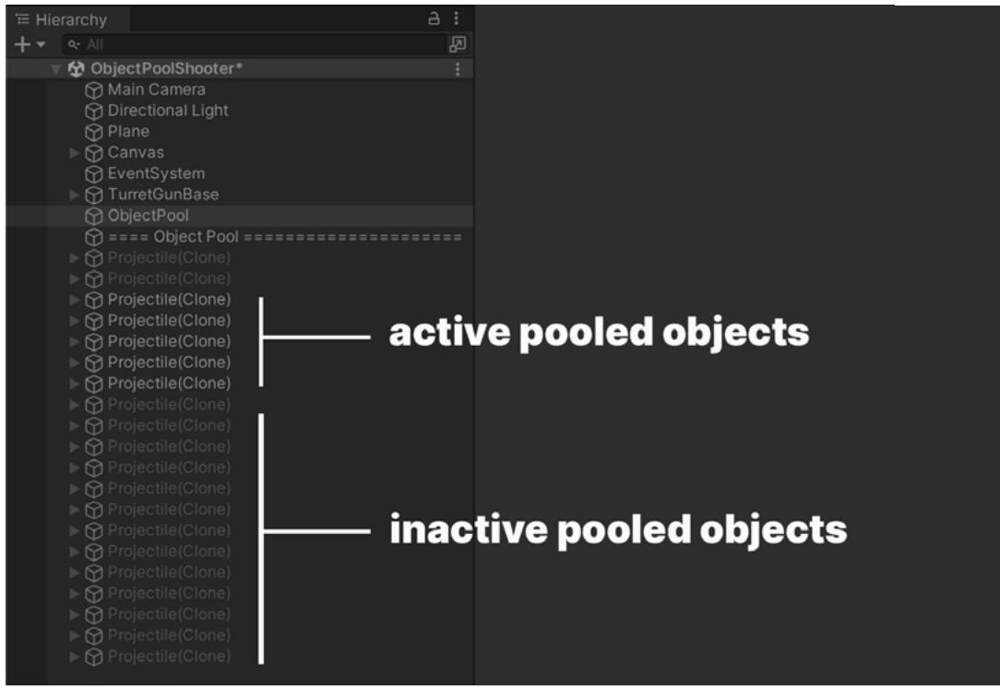

Disable and reuse pooled objects

<span id="page-61-0"></span>This way, you can appear to fire hundreds of bullets offscreen when in reality, you simply disable and recycle them. Just make sure your pool size is large enough to show the concurrently active objects.

If you need to exceed the pool size, the pool can instantiate extra objects. However, most of the time, it pulls from the existing inactive objects.

If you want to see an implementation of creating an object pool from scratch, refer to the **ManualExample** folder in the sample project.

#### UnityEngine.Pool

Unity includes a built-in object pooling system via the [UnityEngine.Pool](https://docs.unity3d.com/2021.1/Documentation/ScriptReference/Pool.ObjectPool_1.html?utm_source=demand-gen&utm_medium=pdf&utm_campaign=clean-code&utm_content=game-programming-patterns-ebook) namespace (available in Unity 2021 LTS and later), so there's no need to create your own PooledObject or ObjectPool classes like in the previous example.

This gives you a stack-based ObjectPool to track your objects with the object pool pattern. Depending on your needs, you can also use a CollectionPool(List, HashSet, Dictionary, etc.)

The sample project shows how to rebuild the manually-created projectile pool using built-in ObjectPool from UnityEngine.Pool:

using UnityEngine.Pool; public class RevisedGun : MonoBehaviour { … // Stack-based ObjectPool available with Unity 2021 and above private IObjectPool<RevisedProjectile> objectPool; // Throw an exception if we try to return an existing item, already in the pool [SerializeField] private bool collectionCheck = true; // Extra options to control the pool capacity and maximum size [SerializeField] private int defaultCapacity = 20; [SerializeField] private int maxSize = 100;


```
 private void Awake()
 {
 objectPool = new ObjectPool<RevisedProjectile>
 (CreateProjectile,OnGetFromPool, OnReleaseToPool,
 OnDestroyPooledObject, collectionCheck, defaultCapacity, maxSize);
 }
 // Invoked when creating an item to populate the object pool
 private RevisedProjectile CreateProjectile()
 {
 RevisedProjectile projectileInstance = Instantiate(projectilePrefab);
 projectileInstance.ObjectPool = objectPool;
 return projectileInstance;
 }
 // Invoked when returning an item to the object pool
 private void OnReleaseToPool(RevisedProjectile pooledObject)
 {
 pooledObject.gameObject.SetActive(false);
 }
 // Invoked when retrieving the next item from the object pool
 private void OnGetFromPool(RevisedProjectile pooledObject)
 {
 pooledObject.gameObject.SetActive(true);
 }
 // Invoked when we exceed the maximum number of pooled items (i.e.
 destroy the pooled object)
 private void OnDestroyPooledObject(RevisedProjectile pooledObject)
 {
 Destroy(pooledObject.gameObject);
 }
 private void FixedUpdate()
 {
 …
 }
}
```
<span id="page-63-0"></span>

Much of the script works for the original ExampleGun script. The [ObjectPool](https://docs.unity3d.com/2021.1/Documentation/ScriptReference/Pool.ObjectPool_1-ctor.html?utm_source=demand-gen&utm_medium=pdf&utm_campaign=clean-code&utm_content=game-programming-patterns-ebook) constructor, however, now includes the helpful ability to set up some logic when:

- First creating a pooled item to populate the pool
- Taking an item from the pool
- Returning an item to the pool
- Destroying a pooled object (e.g., if you hit a maximum limit)

You must then define some corresponding methods to pass into the constructor.

Note how the built-in ObjectPool also includes options for a default pool size and maximum pool size. Items exceeding the max pool size trigger an action to self-destruct, keeping memory usage in check.

The projectile script gets a small modification to keep a reference to the ObjectPool. This makes releasing the object back to the pool a little more convenient.

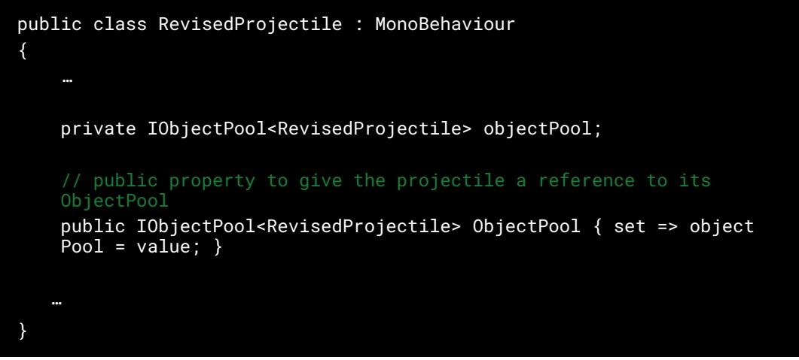

The [UnityEngine.Pool API](https://docs.unity3d.com/2021.1/Documentation/ScriptReference/Pool.ObjectPool_1.html?utm_source=demand-gen&utm_medium=pdf&utm_campaign=clean-code&utm_content=game-programming-patterns-ebook) makes setting up object pools faster, now that you don't have to rebuild the pattern from scratch. That's one less wheel to reinvent.

#### Pros and cons

Object pools are a powerful tool for optimizing performance, but note there are considerations associated with every design pattern.

The object pool offers these advantages:

— **Reduced garbage collection overhead:** Reusing objects instead of creating and destroying them reduces the need for garbage collection. This can prevent performance spikes and stutters at runtime.

<span id="page-64-0"></span>

- **Improved performance:** Initializing objects ahead of time and reactivating them when needed can lead to smoother performance in certain fast-paced games (e.g., shooters).
- **Optimized initialization:** Optimize resources and application startup times by spreading object creation over less critical moments.

Keep in mind, however, these drawbacks:

- **Increased complexity:** Object pools require more management. Be sure to initialize and release objects properly. Otherwise, this can introduce errors or bugs.
- **Memory usage:** While object pools reduce garbage collection, they can lead to higher static memory usage. Object pools store a predefined number of objects in memory, even if they are unused. Balance the pool size according to your project needs.
- **More management:** Determining the optimal size of an object pool can be challenging. Too small of a pool might lead to frequent allocations, while too large of a pool may underutilize the allocated memory.

#### Improvements

The example above is a simple one. When deploying an object pool for actual projects, consider the following upgrades:

- **Make it static or a singleton:** If you need to generate pooled objects from a variety of sources, consider making the object pool static and reusable. This makes it accessible anywhere in your application but precludes use of the Inspector. Alternatively, combine the object pool pattern with the singleton pattern to make it globally accessible for ease of use.
- **Use a dictionary to manage multiple pools:** If you have a number of different Prefabs that you want to pool, store them in separate pools and store a key-value pair so you know which pool to query (the [InstanceID](https://docs.unity3d.com/ScriptReference/Object.GetInstanceID.html?utm_source=demand-gen&utm_medium=pdf&utm_campaign=clean-code&utm_content=game-programming-patterns-ebook) of the Prefab can work as the unique key).
- **Remove unused GameObjects creatively:** Part of utilizing an object pool effectively is hiding unused objects and returning them to the pool. Use every opportunity to deactivate a pooled object (e.g., offscreen, hidden by explosions, etc.)
- **Check for errors:** Avoid releasing an object that is already in the pool. When creating an instance of an **[ObjectPool<T>](https://docs.unity3d.com/ScriptReference/Pool.ObjectPool_1-ctor.html)**, you can set the collectionCheck parameter to true. This throws an exception in the Editor if you try to return an object to the pool that is already in it.
- **Add a maximum size/cap:** Lots of pooled objects consume memory. Use the maxSize parameter in the [ObjectPool](https://docs.unity3d.com/ScriptReference/Pool.ObjectPool_1-ctor.html) [constructor](https://docs.unity3d.com/ScriptReference/Pool.ObjectPool_1-ctor.html) to cap the size of your pool.

How you use object pools will vary by application. This pattern commonly appears when a gun or weapon needs to fire multiple projectiles like in a bullet hell shooter.

Every time you instantiate a large number of objects, you run the risk of causing a small pause from a garbage-collection spike. An object pool alleviates this issue to keep your gameplay smooth.

# <span id="page-65-0"></span>Singleton pattern

Singletons get a bad rap. If you're new to Unity development, the singleton is likely one of the first recognizable patterns that you will encounter. It's also one of the most maligned design patterns.

According to the original Gang of Four, the singleton pattern:

- Ensures that a class can only instantiate one instance of itself
- Gives global access to that single instance

This is useful if you need to have exactly one object that coordinates actions across the entire scene. For example, you might want exactly one game manager in your scene to direct the main game loop. You also probably only want one file manager writing to your filesystem at a time. Central, manager-level objects like these tend to be good candidates for the singleton pattern.

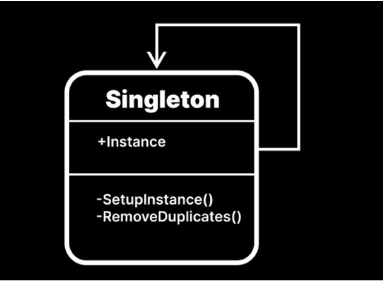

The SimpleSingleton destroys any instances beyond the first.

<span id="page-66-0"></span>

In *Game Programming Patterns*, it says that singletons do more harm than good and lists it as an anti-pattern. This poor reputation is because the pattern's ease of use lends itself to abuse. Developers tend to apply singletons in inappropriate situations, introducing unnecessary global states or dependencies.

Let's examine how to build a singleton in Unity and weigh its strengths and weaknesses. Then you can decide whether it's worth incorporating into your application.

#### Example: Simple singleton

One of the simplest singletons might look like this:

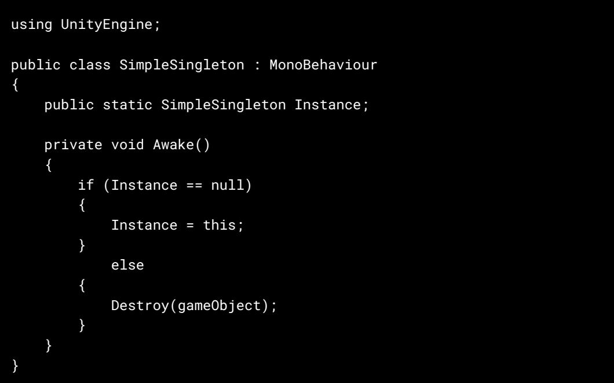

The public static Instance will hold the one instance of Singleton in the scene.

In the Awake method, check if it's already set. If Instance is currently null, then Instance gets set to this specific object. This must be the first singleton in the scene.

Otherwise, this instance must be a duplicate; you call Destroy(gameObject) to guarantee your singleton only has one such component in the scene.

If you attach the script to more than one GameObject in the hierarchy at runtime, the logic in Awake will keep the first object and then discard the rest.

<span id="page-67-0"></span>


The singleton pattern only allows one instance.

The Instance field is public and static. Any component has global access to the lone singleton from anywhere in the scene.

#### Persistence and lazy instantiation

The SimpleSingleton works as written. However, it does suffer from two issues:

Loading a new scene destroys the GameObject.

- You need to set up the singleton in the hierarchy before using it.
- Because the singleton often serves as an omnipresent manager script, you can benefit from making it persistent using a DontDestroyOnLoad.


Further, you can use [lazy instantiation](https://en.wikipedia.org/wiki/Lazy_initialization) to build the singleton automatically when you first need it. You only need some logic to create a GameObject and then add the appropriate Singleton component.

The improved singleton looks something like this:

```
 public class Singleton : MonoBehaviour
 {
 private static Singleton instance;
 public static Singleton Instance
 {
 get
 {
 if (instance == null)
 {
 SetupInstance();
 }
 return instance;
 }
 }
 private void Awake()
 {
 if (instance == null)
 {
 instance = this;
 DontDestroyOnLoad(this.gameObject);
 }
 else
 {
 Destroy(gameObject);
 }
 }
 private static void SetupInstance()
 {
 instance = FindObjectOfType<Singleton>();
 if (instance == null)
 {
 GameObject gameObj = new GameObject();
 gameObj.name = "Singleton";
 instance = gameObj.AddComponent<Singleton>();
 DontDestroyOnLoad(gameObj);
 }
 }
```
<span id="page-69-0"></span>

Instance is now a public property referring to the private instance backing field. The first time you refer to the singleton, check for the existence of Instance in the getting. If it doesn't exist, the SetupInstance method creates a GameObject with the appropriate component.

DontDestroyOnLoad(gameObject) prevents a scene load from clearing the singleton from the hierarchy. The singleton instance is now persistent, staying active even if you change scenes in your game.

#### Using generics

Neither version of the script addresses how to create different singletons within the same scene. For example, if you want a singleton that behaves as an AudioManager and another singleton as a GameManager, they can't coexist right now. You'll need to duplicate the relevant code and paste the logic into each class.

Instead, make a generic version of the script like so:

```
public class Singleton<T> : MonoBehaviour where T : Component
{
 private static T instance;
 public static T Instance
 {
 get
 {
 if (instance == null)
 {
 instance = (T)FindObjectOfType(typeof(T));
 if (instance == null)
 {
 SetupInstance();
 }
 }
 return instance;
 }
 }
 public virtual void Awake()
 {
 RemoveDuplicates();
 }
 private static void SetupInstance()
 {
 instance = (T)FindObjectOfType(typeof(T));
 if (instance == null)
 {
```


This allows you to turn any class into a singleton. When you declare your class, simply inherit from the generic singleton. For example, you can make a MonoBehaviour called GameManager into a singleton by declaring it like so:


Then you can always refer to the public static GameManager.Instance whenever you need it.

<span id="page-71-0"></span>

#### Pros and cons

Singletons are unlike the other patterns in this guide in that they break with SOLID principles in several respects. Many developers dislike them for a variety of reasons:

- **Singletons require global access:** Because you use them as global instances, they can hide many dependencies, making bugs much harder to troubleshoot.
- **Singletons make testing difficult:** Unit tests must be independent of each other. Because the singleton can change the state of many GameObjects across the scene, they can interfere with your testing.
- **Singletons encourage tight coupling:** Most of the patterns in this guide attempt to decouple dependencies. Singletons do the opposite. Tight coupling makes refactoring difficult. If you change one component, you can affect any component connected to it, leading to unclean code.

The nays against singletons are considerable. If you're building an enterprise-level game that you expect to maintain for years to come, you might want to steer clear of singletons.

But many games are not enterprise-level applications. You don't need to extend them continuously the same way you might for business software.

In fact, singletons offer some benefits that you may find attractive if you're building a small game that doesn't need extensibility:

- **Singletons are relatively quick to learn:** The core pattern itself is somewhat straightforward.
- **Singletons are user-friendly:** To use your singleton from another component, simply reference the public and static instance. The singleton instance is always available on demand from any object in your scene.
- **Singletons are performant:** Because you always have global access to the static singleton instance, you can avoid caching the results of GetComponent or Find operations, which tend to be slow.

In this way, you can make a manager object (e.g., game flow manager or audio manager) that is always accessible from every other GameObject in your scene. Also, if you've implemented the object pool, you can design your pooling system as a singleton to make getting pooled objects easier.

If you decide to use singletons in your project, keep them to a minimum. Don't use them indiscriminately. Reserve the singletons for a handful of scripts that can benefit from global access.

## <span id="page-72-0"></span>Command pattern

One of the original Gang of Four patterns, command is useful whenever you want to track a specific series of actions. You've likely seen the command pattern at work if you've played a game that uses undo/redo functionality or keeps your input history in a list. Imagine a strategy game where the user can plan several turns before actually executing them. That's the command pattern.


Instead of invoking a method directly, the command pattern allows you to encapsulate one or more method calls as a "command object."

Storing actions with the command pattern

Storing these command objects in a collection like a queue or a stack allows you to control the timing of their execution. This functions as a small buffer. You can then potentially delay a series of actions for later playback or undo them.

<span id="page-73-0"></span>To implement the command pattern, you need a general object that will contain your action. This command object will hold what logic to perform and how to undo it.

#### The command object and command invoker

There are a number of ways to implement this, but here's one version that uses an interface:

```
public interface ICommand
{
 void Execute();
 void Undo();
}
```
In this case, every gameplay action will apply the ICommand interface (you could also implement this with an abstract class).

Each command object will be responsible for its own Execute and Undo methods. Thus, adding more commands to your game won't affect any existing ones.

You'll need another class to execute and undo commands. Create a CommandInvoker class. In addition to the ExecuteCommand and UndoCommand methods, it has an undo stack to hold the sequence of command objects.

```
public class CommandInvoker
{
 private static Stack<ICommand> undoStack = new Stack<ICommand>();
 public static void ExecuteCommand(ICommand command)
 {
 command.Execute();
 undoStack.Push(command);
 }
 public static void UndoCommand()
 {
 if (undoStack.Count > 0)
 {
 ICommand activeCommand = undoStack.Pop();
 activeCommand.Undo();
 }
 }
}
```
<span id="page-74-0"></span>

#### Example: Undoable movement

Let's imagine you want to move your player around a maze in your application. You could create a PlayerMover responsible for shifting the player's position:


You'll pass in a Vector3 into the Move method to guide the player along the four compass directions. You can also use a raycast to detect the walls in the appropriate LayerMask. Of course, implementing what you want to apply to the command pattern is separate from the pattern itself.


The command pattern can make actions undoable.


To follow the command pattern, capture the PlayerMover's Move method as an object. Instead of calling Move directly, create a new class, MoveCommand, that implements the ICommand interface:

```
public class MoveCommand : ICommand
{
 PlayerMover playerMover;
 Vector3 movement;
 public MoveCommand(PlayerMover player, Vector3 moveVector)
 {
 this.playerMover = player;
 this.movement = moveVector;
 }
 public void Execute()
 {
 playerMover.Move(movement);
 }
 public void Undo()
 {
 playerMover.Move(-movement);
 }
}
```
ICommand requires an Execute method to store what you're trying to accomplish. Whatever logic you want to accomplish goes in here, so invoke Move with the movement vector.

ICommand also needs an Undo method to restore the scene back to its previous state. In this case, the Undo logic subtracts the movement vector, essentially pushing the player in the opposite direction.

The MoveCommand stores any parameters that it needs to execute. Set these up with a constructor. In this case, you save the appropriate PlayerMover component and the movement vector.

Once you create the command object and save its needed parameters, use the CommandInvoker's static ExecuteCommand and UndoCommand methods to pass in your MoveCommand. This runs the MoveCommand's Execute or Undo and tracks the command object in the undo stack.


The CommandInvoker, ICommand, and MoveCommand

The InputManager doesn't call the PlayerMover's Move method directly. Instead, add an extra method, RunMoveCommand, to create a new MoveCommand and send it to the CommandInvoker.

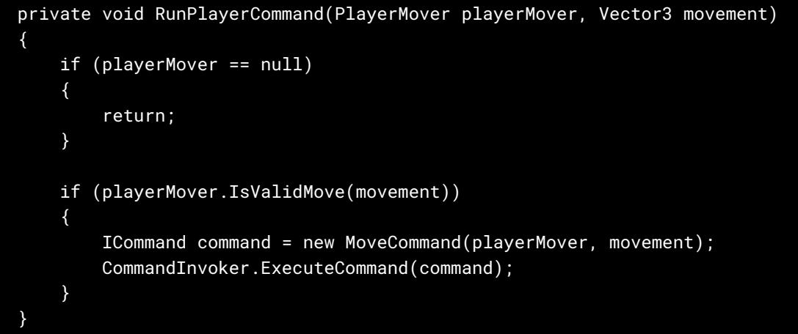

Then, set up the various onClick events of the UI Buttons to call RunPlayerCommand with the four movement vectors.

Check out the sample project for implementation details for the InputManager or set up your own input using the keyboard or gamepad. Your player can now navigate the maze. Click the Undo button so you can backtrack to the beginning square.

<span id="page-77-0"></span>

### Pros and cons

Implementing replayability or undoability is as simple as generating a collection of command objects. You can also use the command buffer to play back actions in sequence with specific controls.

For example, think about a fighting game where a series of specific button clicks triggers a combo move or attack. Storing player actions with the command pattern makes setting up such combos much simpler.

On the flip side, the command pattern introduces more structure, just like the other design patterns. You'll have to decide where these extra classes and interfaces provide enough benefit for deploying command objects in your application.

#### Improvements

Once you learn the basics, you can affect the timing of commands and play them back in succession or reverse, depending on the context.

Consider the following when incorporating the command pattern:

- **Create more commands:** The sample project only includes one type of command object, the MoveCommand. You can create any number of command objects that implement ICommand and track them using the CommandInvoker.
- **Adding redo functionality is a matter of adding another stack:** When you undo a command object, push it onto a separate stack that tracks redo operations. This way you can quickly cycle through the undo history or redo those actions. Clear out the redo stack when the user invokes an entirely new movement (you can find an implementation in the accompanying sample project).

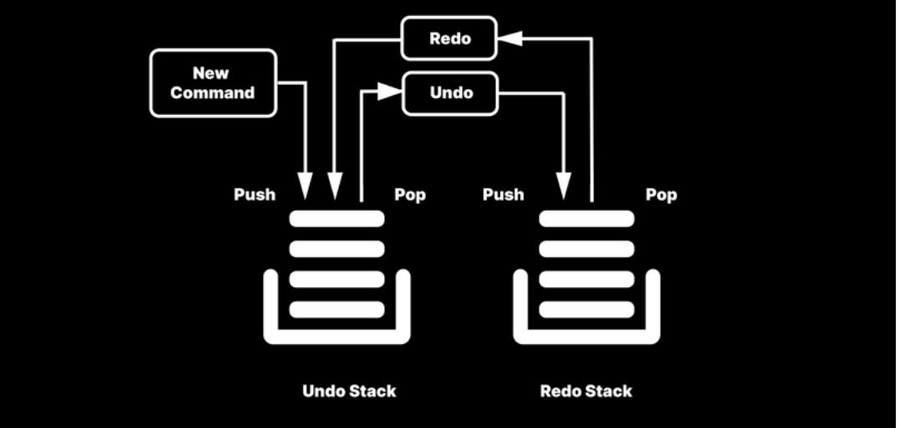

Undo and redo stacks

— **Use a different collection for your buffer of command objects:** A queue might be handier if you want first in, first out (FIFO) behavior. If you use a list, track the currently active index; commands before active index are undoable. Commands after the index are redoable.

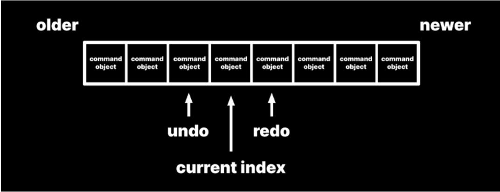

A list or other collection acts as a command buffer.

- **Limit the size of the stacks:** Undo and redo operations can quickly blow up out of control. Limit the stacks to the last number of commands.
- **Pass any necessary parameters into the constructor:** This helps encapsulate the logic as seen in the MoveCommand example.

The CommandInvoker, like other external objects, doesn't see the inner workings of the command object, only invoking Execute or Undo. Give the command object any data needed to work when calling the constructor.

# <span id="page-79-0"></span>State pattern

Imagine constructing a playable character. At one moment, the character may be standing on the ground. Move the controller, and it appears to run or walk. Press the jump button and the character leaps into midair. A few frames later, it lands and reenters its idle, standing position.

#### States and state machines

Games are interactive, and they force us to track many systems that change at runtime. If you draw a [diagram](https://en.wikipedia.org/wiki/State_diagram) that represents the different states of your character, you might come up with something like this:


A simple state diagram


This describes something called a [finite-state machine](https://en.wikipedia.org/wiki/Finite-state_machine) (FSM), which resembles a flowchart with a few differences:

- The diagram consists of a number of states (Idling/Standing, Walking, Running, Jumping, and so on), and only one current state is active at a given time.
- Each state can trigger a transition to one other state based on conditions at runtime.
- When a transition occurs, the output state becomes the new active state.

In game development, one typical use case for an FSM is for tracking the internal state of a game actor or prop.

To set up a basic state machine in code, you might use a naive approach with an enum and a switch statement.

```
public enum PlayerControllerState
{
 Idle,
 Walk,
 Jump
}
public class UnrefactoredPlayerController : MonoBehaviour
{
 private PlayerControllerState state;
 private void Update()
 {
 GetInput();
 switch (state)
 {
 case PlayerControllerState.Idle:
 Idle();
 break;
 case PlayerControllerState.Walk:
 Walk();
 break;
 case PlayerControllerState.Jump:
 Jump();
 break;
 }
 }
 private void GetInput()
 {
```
<span id="page-81-0"></span>

This would work, but the PlayerController script can get messy quickly. Adding more states and complexity can make the class balloon up. It also requires us to revisit the PlayerController script's internals each time we want to make a change.

In keeping with SOLID principles, we want to make our classes shorter and more focused. Keeping them closed for modification but open for extension ensures better scalability and manageability.

#### Example: Simple state pattern

Fortunately, the [state pattern](https://en.wikipedia.org/wiki/State_pattern) can help you reorganize the logic. According to the original Gang of Four, the state pattern solves two problems:

- An object should change its behavior when its internal state changes.
- State-specific behavior is defined independently. Adding new states does not impact the behavior of existing states.

While the above example UnrefactoredPlayerController class can track state changes, it does not satisfy the second issue. You want to minimize the impact on existing states when you add new ones. Instead, you can encapsulate a state as an object.


#### Imagine structuring each state like this:


The encapsulated state with an Entry, Exit, and Execute

Here you enter the state and loop each frame until a condition causes control flow to exit. To implement this pattern, create an interface, IState:

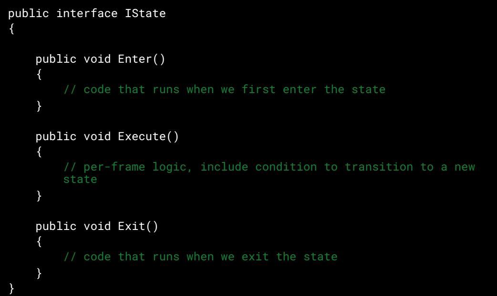


Each concrete state in your game will implement the IState interface:

- **An Entry:** This logic executes when first entering the state.
- **Execute:** This logic runs every frame (sometimes called Tick or Update). You can further segment the Execute method as MonoBehaviour does with Update, FixedUpdate, LateUpdate, and so on.

Any functionality in the Execute runs each frame until a condition is detected that triggers a state change.

— **An Exit:** Code here runs before leaving the state and transitioning to a new state.

You'll need to create a class for each state that implements IState. In the sample project, a separate class has been set up for WalkState, IdleState, and JumpState.

Another class, the StateMachine, will then manage how control flow enters and exits the states. With the three example states, the StateMachine could look like this:

```
 [Serializable]
public class StateMachine
{
 public IState CurrentState { get; private set; }
 public WalkState walkState;
 public JumpState jumpState;
 public IdleState idleState;
 public void Initialize(IState startingState)
 {
 CurrentState = startingState;
 startingState.Enter();
 }
 public void TransitionTo(IState nextState)
 {
 CurrentState.Exit();
 CurrentState = nextState;
 nextState.Enter();
 }
 public void Execute()
 {
 if (CurrentState != null)
 {
 CurrentState.Execute();
 }
 }
}
```


To follow the pattern, the StateMachine references a public object for each state under its management (in this case, walkState, jumpState, and idleState). Because StateMachine doesn't inherit from MonoBehaviour, use a constructor to set up each instance:

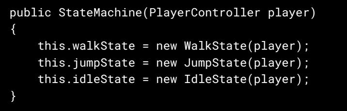

You can pass in any parameters needed to the constructor. In the sample project, a PlayerController is referenced in each state. You then use that to update each state per frame (see the IdleState example below).

Note the following about the StateMachine:

- The Serializable attribute allows us to display the StateMachine (and its public fields) in the Inspector. Another MonoBehaviour (e.g., a PlayerController or EnemyController) can then use the StateMachine as a field.
- The CurrentState property is read-only. The StateMachine itself does not explicitly set this field. An external object like the PlayerController can then invoke the Initialize method to set the default State.
- Each State object determines its own conditions for calling the TransitionTo method to change the currently active state. You can pass in any necessary dependencies (including the State Machine itself) to each state when setting up the StateMachine instance.

In the example project, the PlayerController already includes a reference to the StateMachine, so you only pass in one player parameter.

Each state object will manage its own internal logic, and you can make as many states as needed to describe your GameObject or component. Each one gets its own class that implements IState. In keeping with the SOLID principles, adding more states has minimal impact on any previously created states.


Here's an example of the IdleState:

```
public class IdleState : IState
{
 private PlayerController player;
 public IdleState(PlayerController player)
 {
 this.player = player;
 }
 public void Enter()
 {
 // code that runs when we first enter the state
 }
 public void Execute()
 { 
 // Here we add logic to detect if the conditions exist to 
 // transition to another state
 …
 }
 public void Exit()
 {
 // code that runs when we exit the state
 }
}
```
Again, use the constructor to pass in the PlayerController object. In the example, this player contains a reference to the StateMachine and everything else needed for the Update logic. The idleState monitors the Character Controller's velocity or jump state and then invokes the StateMachine's TransitionTo method appropriately.

Review the sample project for the WalkState and JumpState implementation as well. Rather than have one large class that switches behavior, each state has its own update logic. This way, states can function independently from one another.

### <span id="page-86-0"></span>Pros and cons

The state pattern can help you adhere to the SOLID principles when setting up internal logic for an object. Each state is relatively small and just tracks the conditions for transitioning into another state. In keeping with the open-closed principle, you can add more states without affecting existing ones and avoid cumbersome switch or if statements.

On the other hand, if you only have a few states to track, the extra structure can be overkill. This pattern might only make sense if you expect your states to grow to a certain complexity.


The state pattern tracks an object's internal state.

#### Improvements

The capsule in the sample project changes color, and the UI updates with the player's internal state. In a real-world example, you could have much more complex effects to accompany the state changes:

— **Combine the state pattern with animation:** One common application for the state pattern is animation. The player or enemy characters are often represented as primitives (a capsule) on a macro level. Then, you can have animated geometry that reacts to internal state changes, so the game actor can appear to be running, jumping, swimming, climbing, etc.

If you've used Unity's Animator window, you'll notice that its workflow pairs well with the state pattern. Each animation clip occupies one state, with only one state active at a time.


An example of an Animator state graph: Compare its structure with a StateMachine.

- **Add events:** To communicate state changes to outside objects, you might want to add events (see the observer pattern). Having an event on entering or exiting a state can notify the relevant listeners and have them respond at runtime.
- **Add a hierarchy:** As you begin to describe more complex entities with the state pattern, you might want to implement hierarchical state machines. Inevitably some states will be similar; for example, if the player or game actor is grounded, it can duck or jump whether in a WalkingState or RunningState.

If you implement a SuperState, you can keep common behaviors together. Then using inheritance, you can override anything specific in a sub-state. For example, you might first declare a GroundedState. You could then inherit a RunningState or WalkingState from that.

<span id="page-88-0"></span>

— **Implement simple AI:** Finite-state machines can also be useful in generating basic enemy AI. An FSM approach to building an NPC brain might look like this:


A simple AI based on state patterns

Here's the state pattern at work again in a completely different context. Every state represents an action, such as attacking, fleeing, or patrolling. Only one state is active at a time, with each state determining its transition to the next one.

#### Example: Game states

In the previous example, the character's material color and UI label update when the player moves, jumps, or stands idle. Apply the state pattern to wherever you need to track an object's internal state. Character animation is a prime example – so much so that Unity includes a [built-in state machine](https://docs.unity3d.com/ScriptReference/Animations.AnimatorStateMachine.html) into its [AnimatorController.](https://docs.unity3d.com/ScriptReference/Animations.AnimatorController.html)

The sample project includes a more advanced state machine for another practical application of the state pattern – maintaining your game states. The demo itself uses this state machine to manage its behavior at runtime.


Inside the **Scripts/StateMachine** folder are several components to build and customize a more sophisticated state machine:

- The StateMachine tracks an object's current state and handles transitions between various states. It executes each state's lifecycle methods and monitors state changes in a loop.
- An IState interface defines standardized functionality for each state object (lifecycle methods such as Enter, Execute, and Exit as well as transitions to other states).
- AbstractState implements the IState interface and serves as the base class for all states.

To set up the state pattern, define concrete states:

- A general purpose State class can execute predefined actions upon entry and execution.
- DelayState introduces a waiting period before transitioning to the next state, useful for progress bars or load screens.
- LoadSceneState and UnloadLastSceneState are state classes designed for managing scene transitions. These states can load or unload scenes additively, allowing us to divide the project content into individual Unity scenes.

To transition to other states, implement logic that responds to specific conditions or events. This allows for state changes due to game events or user input:

- The ILink interface defines a transition between states.
- Implement an EventLink to trigger a transition based on a specific C# event.
- Implement an EventSOLink to trigger a transition based on a specific ScriptableObjectbased event.
- Implement a SceneEventSOLink to trigger a transition based on a specific sceneloading event.

The state machine uses several event channels (using both custom C# events and ScriptableObject-based events) to communicate with any other systems in the application.

Put all of these together and you can build a state machine that works with many different types of applications. Just create additional states or transitions as your project requires.

In the sample project, the GameManager uses this state machine to drive the application's general flow. The system uses ScriptableObject-based events to transition from the menu UIs to demo content.

User interactions (e.g. button clicks) notify the GameManager to change its internal state. The UI then updates according to this state diagram:

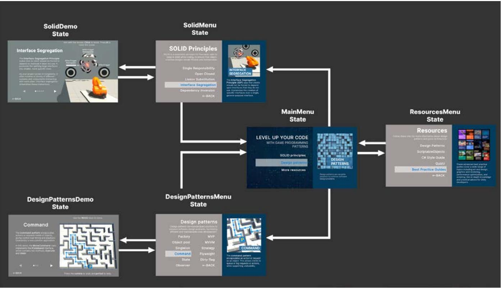

The GameManager state diagram.

While the example focuses on UI updates, the GameManager states can be customized to meet your application's specific needs.

Here, using the state pattern makes it easier to assemble your application from smaller parts. Each menu button raises an event. That event, in turn, triggers the transition to a new state and loads the corresponding demo content.

Introducing new functionality is as straightforward as adding a new state and configuring the necessary transitions. In keeping with SOLID, building a new part to your application does not affect the existing project.

<span id="page-91-0"></span>

### Explore the QuizU Project

Want to see more design patterns in action? The [QuizU](https://assetstore.unity.com/packages/essentials/tutorial-projects/quizu-a-ui-toolkit-sample-268492) sample project also showcases the use of MVP and state patterns in its main menus, built using the UI Toolkit. This project also features a variation of this state machine in the main game loop. You can explore the project along with its [companion series of articles](https://discussions.unity.com/t/welcome-to-the-new-ui-toolkit-sample-project-quizu/308607) on Unity Discussions.


The QuizU project uses the state pattern for managing game states.

## <span id="page-92-0"></span>Observer pattern

At runtime, any number of things can occur in your game. What happens when you destroy an enemy? How about when you collect a power-up or complete an objective? You often need a mechanism that allows some objects to notify others without directly referencing them, thereby creating unnecessary dependencies.

The observer pattern is a common solution to this sort of problem. It allows your objects to communicate but stay loosely coupled using a "one-to-many" dependency. When one object changes states, all dependent objects get notified automatically. This is analogous to a radio tower that broadcasts to many different listeners.

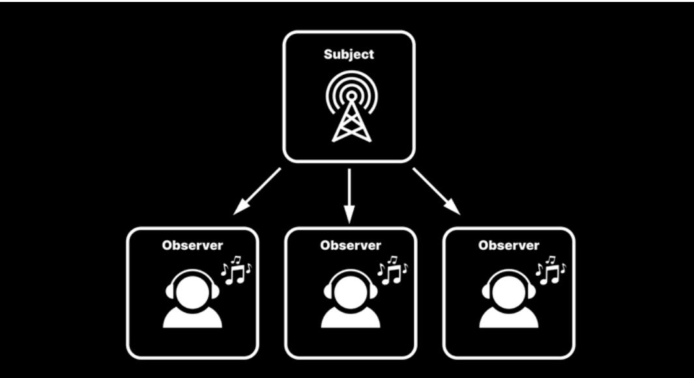

The observer pattern functions like a radio tower. The subject broadcasts to the observers.

<span id="page-93-0"></span>

The object that is broadcasting is called the subject. The other objects that are listening are called the observers.

This pattern loosely decouples the subject, which doesn't really know the observers or care what they do once they receive the signal. While the observers have a dependency on the subject, the observers themselves don't know about each other.

#### Events

The observer pattern is so widespread that it's built into the C# language. You can design your own subject-observer classes but it's usually unnecessary. Remember the point about reinventing the wheel? C# already implements the pattern using events.

An event is simply a notification that indicates something has happened. It involves a few parts:

- The publisher (the subject) creates an event based on a [delegate,](https://docs.microsoft.com/en-us/dotnet/csharp/programming-guide/delegates/) establishing a specific function signature. The event is just some action that the subject will perform at runtime (e.g., take damage, click a button, and so on).
- The subscribers (the observers) then each make a method called an event handler*,* which must match the delegate's signature.
- Each observer's event handler subscribes to the publisher's event. You can have as many observers join the subscription as necessary. All of them will wait for the event to trigger.
- When the publisher signals the occurrence of an event at runtime, you say that it raises the event. This, in turn, invokes the subscribers' event handlers, which run their own internal logic in response.

In this way, you make many components react to a single event from the subject. If the subject indicates that a button is clicked, the observers could play back an animation or sound, trigger a cutscene, or save a file. Their response could be anything, which is why you'll frequently find the observer pattern used to send messages between objects.

<span id="page-94-0"></span>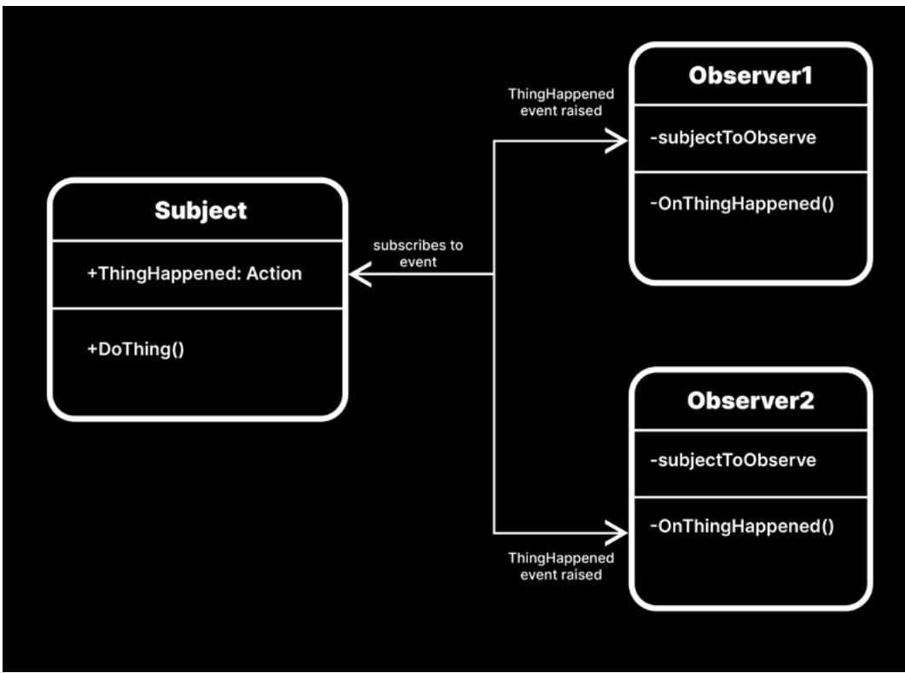

The subject raises the event to notify the observers.

### Example: Simple subject and observer

For example, you might define a basic subject/publisher like this:


Here, you inherit from MonoBehaviour to attach to a GameObject more easily, but that's not required.


While you are free to define your own custom delegate, [System.Action](https://docs.microsoft.com/en-us/dotnet/api/system.action?view=net-6.0) works in most cases. If you need to send parameters with the event, use the [Action<T>](https://docs.microsoft.com/en-us/dotnet/api/system.action-1?view=net-6.0) delegate and pass them as a [List<T>](https://docs.microsoft.com/en-us/dotnet/api/system.collections.generic.list-1?view=net-6.0) within the angle brackets (up to 16 parameters).

ThingHappened is the actual event, which the subject invokes in the DoThing method.

To listen to the event, you can build an example Observer class. Here you inherit from MonoBehaviour for convenience, but that's not required.

```
public class Observer : MonoBehaviour
{
 [SerializeField] private Subject subjectToObserve;
 private void OnThingHappened()
 {
 // any logic that responds to event goes here
 Debug.Log("Observer responds");
 }
 private void OnEnable()
 {
 if (subjectToObserve != null)
 {
 subjectToObserve.ThingHappened += OnThingHappened;
 }
 }
 private void OnDisable()
 {
 if (subjectToObserve != null)
 {
 subjectToObserve.ThingHappened -= OnThingHappened;
 }
 }
}
```
Attach this component to a GameObject and reference the subjectToObserver in the Inspector order to listen for the ThingHappened event.

The OnThingHappened method can contain any logic the observer executes in response to the event. Often developers add the prefix "On" to denote the event handler (just use the naming convention from your style guide).

<span id="page-96-0"></span>

In the Awake or Start, you can subscribe to the event with the += operator. That [combines](https://docs.microsoft.com/en-us/dotnet/csharp/programming-guide/delegates/how-to-combine-delegates-multicast-delegates) the observer's OnThingHappened method with the subject's ThingHappened.

If anything runs the subject's DoThing method, that raises the event. Then, the observer's OnThingHappened event handler invokes automatically and prints the debug statement.

Note: If you delete or remove the observer at runtime while it's still subscribed to the ThingHappened, calling that event could result in an error. Thus, it's important to unsubscribe from the event in the MonoBehaviour's OnDestroy method with -= operator.

Unsubscribing from events in the MonoBehaviour's OnDestroy method with the -= operator is crucial. It prevents memory leaks, avoids null references, and keeps the code clean by managing event subscriptions throughout the Unity object's lifecycle.

## Naming conventions

There isn't a single convention for naming the parts of the observer pattern. In your style guide, be sure to identify how to name these parts:

- **Events:** This is the actual action or signal. In this example, the event is called ThingHappened.
- **Event handlers:** This is the logic that happens in response to the event. In this example, the event handler is prefixed with "On." The event handler OnThingHappened executes in response to the ThingHappened event.
- **Event-raising methods:** This is a method that invokes the event. In this example, DoThing is the event-raising method.

Events are often named with descriptive verbs indicating the action or occurrence (e.g. DoorOpened, DamageReceived). Using a naming convention for the events, their triggers, and their responses can help make their relationship more clear.

For more information about creating your team's own C# style guide, see the e-book, *[Create a C# style guide: Write cleaner code that scales](https://unity.com/resources/create-code-c-sharp-style-guide-e-book?isGated=false)*.

You can apply the observer pattern to nearly everything that happens during the course of gameplay. For example, your game could raise an event every time the player destroys an enemy or collects an item. If you need a statistics system that tracks scores or achievements, the observer pattern could allow you to create one without affecting the original gameplay code.


Many Unity applications apply events to:

- Objectives or goals
- Win/lose conditions
- PlayerDeath, EnemyDeath, or Damage
- Item pickups
- User interface

The subject simply needs to raise an event at the opportune time, and then any number of observers can subscribe.

|                                                                                                                                                                                                                                                                      | Click the button to make the observers react. |           |  |
|----------------------------------------------------------------------------------------------------------------------------------------------------------------------------------------------------------------------------------------------------------------------|-----------------------------------------------|-----------|--|
| Observer                                                                                                                                                                                                                                                             |                                               |           |  |
| The observer pattern creates a 'one-to-<br>many dependency among objects,<br>enabling automatic updates in response<br>to state changes.<br>Click the button to invoke an event.<br>Each observer reacts uniquely to the<br>subject's state changes: playing sounds, |                                               |           |  |
| triggering animations, or launching<br>particle effects.<br>0000                                                                                                                                                                                                     | Subject                                       | Observers |  |
| ←BACK                                                                                                                                                                                                                                                                |                                               |           |  |

The observer sample scene

In the sample project, the ButtonSubject allows the user to invoke a Clicked event with the mouse button. Several other GameObjects with the AudioObserver and ParticleSystemObserver components can then respond in their own ways to the event.

Determining which object is a "subject" and which one is an "observer" only varies by usage. Anything that raises the event acts as the subject, and anything that responds to the event is the observer. Different components on the same GameObject can be subjects or observers. Even the same component can be a subject in one context and an observer in another.

For instance, the AnimObserver in the example adds a little bit of movement to the button when clicked. It acts as an observer even though it's part of the ButtonSubject GameObject.

<span id="page-98-0"></span>

## UnityEvents and UnityActions

Unity also includes a separate system of **[UnityEvents](https://docs.unity3d.com/ScriptReference/Events.UnityEvent.html)**, which uses the **[UnityAction](https://docs.unity3d.com/ScriptReference/Events.UnityAction.html)** delegate from the **UnityEngine.Events** API.

UnityEvents provide a graphical interface for the observer pattern. These offer an artistfriendly approach for quick prototyping or for setting up interactions without needing additional code. If you've used Unity's UI system (e.g., creating a [UI Button'](https://docs.unity3d.com/Packages/com.unity.ugui@1.0/manual/script-Button.html)s OnClick event), you already have some experience with it.

| ▼ @ / Button        |                                 | 1<br>0 |   |     |
|---------------------|---------------------------------|--------|---|-----|
| Interactable        | V                               |        |   |     |
| Transition          | Color Tint                      |        |   | D   |
| Target Graphic      | Button (Legacy) (Image)         |        |   | 0   |
| Normal Color        |                                 |        |   | 100 |
| Highlighted Color   |                                 |        |   | A   |
| Pressed Color       |                                 |        |   | A   |
| Selected Color      |                                 |        |   | 100 |
| Disabled Color      |                                 |        |   | 0   |
| Color Multiplier    |                                 | 1      |   |     |
| Fade Duration       | 0.1                             |        |   |     |
| Navigation          | Automatic                       |        |   | 9   |
|                     | Visualize                       |        |   |     |
| On Click ()         |                                 |        |   |     |
| Runtime Only        | - AudioObserver.OnThingHappened |        | A |     |
| AudioObserver (Au O |                                 |        |   |     |
| Runtime Only        | · AudioObserver.OnThingHappened |        | D |     |
| AudioObserver (Au O |                                 |        |   |     |
|                     |                                 | +      |   |     |

UnityEvents have graphical components for your setup.

In this example, the button's OnClick event invokes and triggers a response from the two AudioObservers' OnThingHappened methods. You can thus set up a subject's event without code.

UnityEvents are useful if you want to allow designers or non-programmers to create gameplay events. However, be aware that they may be slower than their equivalent events or actions from the System namespace.

Weigh performance versus usage when considering UnityEvents and UnityActions. See the [Create a Simple Messaging System with Events](https://learn.unity.com/tutorial/create-a-simple-messaging-system-with-events) module on Unity Learn for an example.

<span id="page-99-0"></span>

#### Pros and cons

Implementing an event adds some extra work but does offer advantages:

- **The observer pattern helps decouple your objects:** The event publisher does not need to know anything about the event subscribers themselves. Instead of creating a direct dependency between one class and another, the subject and observer communicate while maintaining a degree of separation.
- **You don't have to build it:** C# includes an established event system, and you can use [System.Action](https://docs.microsoft.com/en-us/dotnet/api/system.action?view=net-6.0) delegate instead of defining your own delegates. Alternatively, Unity also includes [UnityEvents](https://docs.unity3d.com/ScriptReference/Events.UnityEvent.html) and [UnityActions](https://docs.unity3d.com/ScriptReference/Events.UnityAction.html).
- **Each observer implements its own event handling logic:** In this way, each observing object maintains the logic it needs to respond. This makes it easier to debug and unit test.
- **It's well-suited for user interface:** Your core gameplay code can live separately from your UI logic. Your UI elements then listen for specific game events or conditions and respond appropriately. The MVP and MVC patterns use the observer pattern for this purpose.

Be aware of these caveats for the observer pattern:

- **It adds additional complexity:** Like other patterns, creating event-driven architecture does require more setup up front. Also, be careful deleting subjects or observers. Make sure you unregister observers in OnDestroy.
- **The observers need a reference to the class that defines the event:** Observers still have a dependency to the class that is publishing the event. Using a static EventManager (below) that handles all events can help disentangle objects from each other.
- **Performance can be an issue:** Event-driven architecture adds extra overhead. Large scenes and many GameObjects can hinder performance.

#### Improvements

While only a basic version of the observer pattern is introduced here, you can expand this to handle all of your game application's needs.

Consider these suggestions when setting up the observer pattern:

- **Use the ObservableCollection class:** C# provides a dynamic [ObservableCollection](https://docs.microsoft.com/en-us/dotnet/api/system.collections.objectmodel.observablecollection-1?view=net-5.0) to track specific changes. It can notify your observers when items get added, removed, or when the list is refreshed.
- **Pass a unique instance ID as an argument:** Each GameObject in the hierarchy has a unique [instance ID.](https://docs.unity3d.com/ScriptReference/Object.GetInstanceID.html) If you trigger an event that could apply to more than one observer, pass the unique ID into the event (use type [Action<int>](https://docs.microsoft.com/en-us/dotnet/api/system.action-1?view=net-6.0)). Then only run the logic in the event handler if the GameObject matches the unique ID.


— **Create a static EventManager:** Because events can drive much of your gameplay, many Unity applications use a static or singleton EventManager. This way, your observers can reference a central source of game events as the subject to make setup easier.

The [FPS Microgame](https://learn.unity.com/project/fps-template) has a good implementation of a static EventManager which implements custom GameEvents and includes static helper methods to add or+remove listeners.

The [Unity Open Project](https://github.com/UnityTechnologies/open-project-1) also showcases a game architecture that uses [ScriptableObjects](https://youtu.be/WLDgtRNK2VE)  [to relay UnityEvents.](https://youtu.be/WLDgtRNK2VE) It uses events to play audio or load new scenes.

— **Create an event queue:** If you have a lot of objects in your scene, you might not want to raise your events all at once. Imagine the cacophony of a thousand objects playing back sounds when you invoke a single event.

Combining the observer pattern with the command pattern allows you to encapsulate your events into an event queue. Then you can use a command buffer to play back the events one at a time or selectively ignore them as necessary (e.g., if you have a maximum number of objects that can make sounds at once).

The observer pattern heavily figures into the Model View Presenter (MVP) architectural pattern, which is covered in more detail in the next chapter.

# <span id="page-101-0"></span>Model View Presenter (MVP)

Model View Controller (MVC) is a family of design patterns commonly used when developing user interfaces.

The general idea behind MVC is to separate the logical portion of your software from the data and from the presentation. Games, like other applications, rely on user interface to connect the player with the program's underlying data. The UI and data components can often span various parts of the application, leading to potential issues if directly coupled.

Tightly coupled components can introduce unnecessary dependencies, increasing the complexity of the codebase and making it more susceptible to bugs. The MVC pattern promotes modularity and looser coupling between parts of the application. This helps reduce unnecessary dependencies and potentially cut down on [spaghetti code](https://en.wikipedia.org/wiki/Spaghetti_code).

#### Model View Controller (MVC) design pattern

As the name implies, the MVC pattern splits your application into three layers:

- **The Model stores data:** The Model is strictly a data container that holds values. It does not perform gameplay logic or run calculations.
- **The View is the interface:** The View formats and renders a graphical presentation of your data on screen.
- **The Controller handles logic:** Think of this as the brain. It processes the game data and calculates how the values change at runtime.

<span id="page-102-0"></span>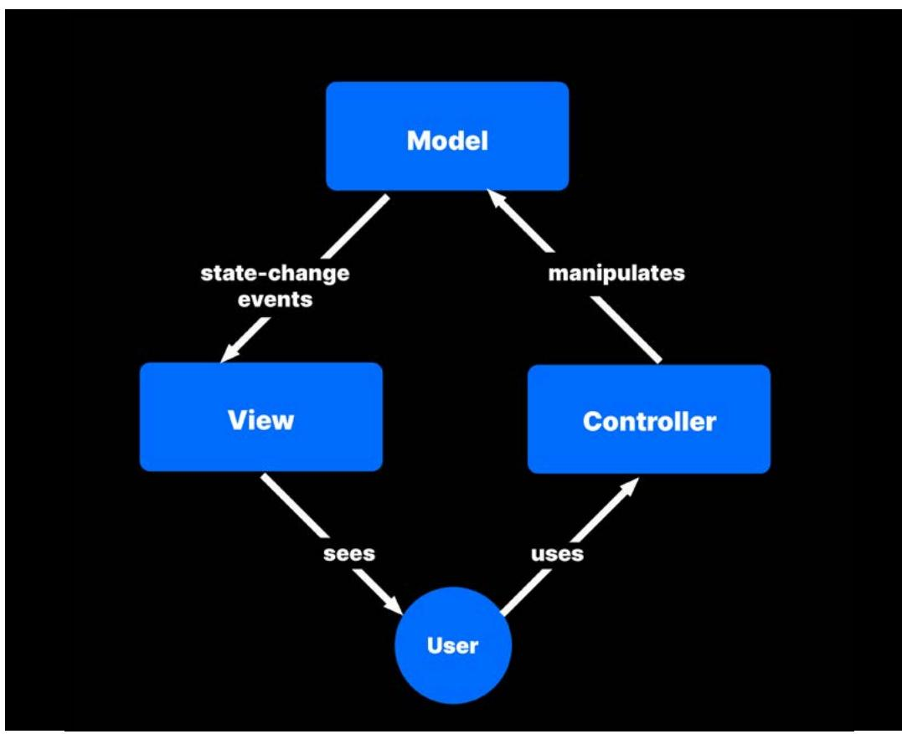

The Model, View, and Controller

This separation of concerns also specifically defines how these three parts interact with one another. The Model manages the application data, while the View displays that data to the user. The Controller handles input and performs any decisions or calculations on the game data. Then it sends the results back to the Model.

Thus, the Controller does not contain any game data unto itself. Nor does the View. The MVC design limits what each layer does. One part holds the data, another part processes the data, and the last one displays that data to the user.

On the surface, you can think of this as an extension of the single-responsibility principle. Each part does one thing and does it well, which is one advantage of MVC architecture.

### Model View Presenter (MVP) and Unity

When developing a Unity project with MVC, the existing UI framework (either the [UI Toolkit](https://docs.unity3d.com/Manual/UIElements.html) or [Unity UI](https://docs.unity3d.com/Manual/com.unity.ugui.html)) naturally functions as the View. Because the engine gives you a complete user interface implementation, you won't need to develop individual UI components from scratch.

However, following the traditional MVC pattern would require View-specific code to listen for any changes in the Model's data at runtime.

<span id="page-103-0"></span>While this is a valid approach, many Unity developers opt to use a variation on MVC where the Controller acts as an intermediary. Here, the View doesn't directly observe the Model. Instead, it does something like this:


MVP: A variation on MVC

This variation on MVC is called the Model View Presenter design, or MVP. MVP still preserves the separation of concerns with three distinct application layers. However, it slightly changes each part's responsibilities.

In MVP, the Presenter (called the Controller in MVC) acts as a go-between for the other layers. It retrieves data from the Model and then formats it for display in the View. MVP switches which layer handles input. Rather than the Controller, the View is responsible for handling user input.

Note how the architecture leverages events and the observer pattern. While the View captures user inputs through UI elements like buttons, toggles, and sliders, it relays these inputs to the presenter via events. The Presenter then updates the model based on these interactions. Once the data has been updated, another event informs the Presenter. It then refreshes the UI using the modified data.

#### Example: Health interface

To formalize an MVP example, imagine a simple system to show the health of a character or item. You could stuff everything into one class that mixes the data and UI, but that wouldn't scale well. Adding more functionality would become more complicated as you need to expand it.

Instead, you can rewrite your health components in a more MVP-centric way. Divide your scripts into a HealthModel and HealthPresenter.


In MVP, any object can hold the health data, but using a ScriptableObject works well here since it decouples behavior from the data itself. The sample HealthModel ScriptableObject looks something like this:

```
[CreateAssetMenu(fileName = "HealthData", menuName = "DesignPatterns/
MVP/HealthModel")]
public class HealthModel : ScriptableObject
{
 public event Action HealthChanged;
 public int CurrentHealth;
 public string LabelName;
 ...
 public void Increment(int amount) { ... }
 public void Decrement(int amount) { ... }
 public void Restore() { ... }
}
```
HealthModel only stores the actual health value, CurrentHealth, and invokes an event, HealthChanged, every time that value changes. HealthModel does not contain gameplay logic, only methods to increment and decrement the data. It also contains a string field for the LabelName.

The sample uses UI Toolkit, so the View is defined in UXML. The interface includes the health bar itself, a status label, and a value label. The visual representation is styled using a USS file. Manage these assets in the UI Builder or directly as text.

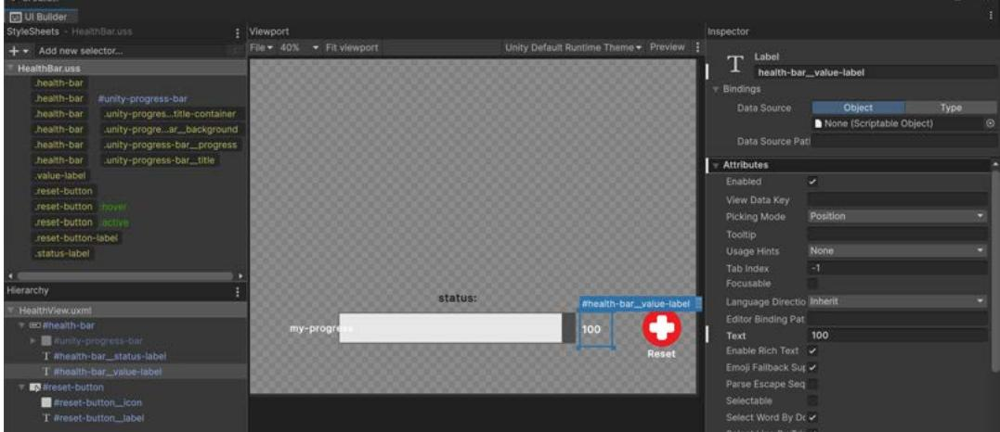

The UXML in the UI Builder


The HealthPresenter acts as a mediator between the data layer of the Model and the user interface of the View. It updates the UI in response to HealthModel changes and handles user input to modify health data.

Serialized fields reference the UI Document (the View) and the m\_HealthModelAsset ScriptableObject (the Model).

```
public class HealthPresenter : MonoBehaviour
{
 [SerializeField] private UIDocument m_Document;
 [SerializeField] private HealthModel m_HealthModelAsset;
 private VisualElement m_Root;
 private ProgressBar m_HealthBar;
 private Label m_StatusLabel;
 private Label m_ValueLabel;

 private void OnEnable()
 {
 NullRefChecker.Validate(this);
 m_Root = m_Document.rootVisualElement;
 ...
 if (m_HealthModelAsset != null)
 {
 m_HealthModelAsset.HealthChanged += OnHealthChanged;
 UpdateUI();
 }
 }
 private void OnHealthChanged() => UpdateUI();
 private void OnDisable()
 {
 if (m_HealthModelAsset != null)
 m_HealthModelAsset.HealthChanged -= OnHealthChanged;
 }
 private void UpdateUI()
 {
 ...
 // Logic to update UI elements based on the health model data
 }
```
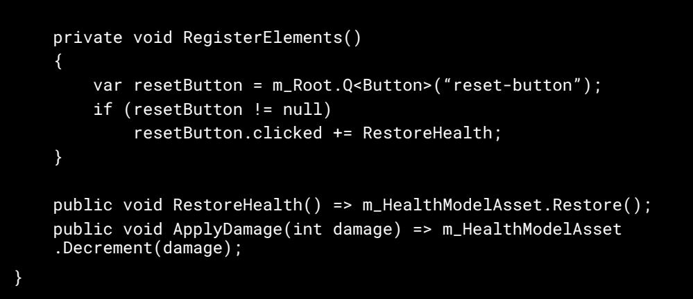

Other GameObjects will need to use the HealthPresenter to modify the health values using ApplyDamage and RestoreHealth methods.

Importantly, the HealthPresenter includes an UpdateUI method responsible for keeping the View in sync with the Model data. This method is called in the OnHealthChanged event handler, which is raised every time the health data changes in the HealthModel.

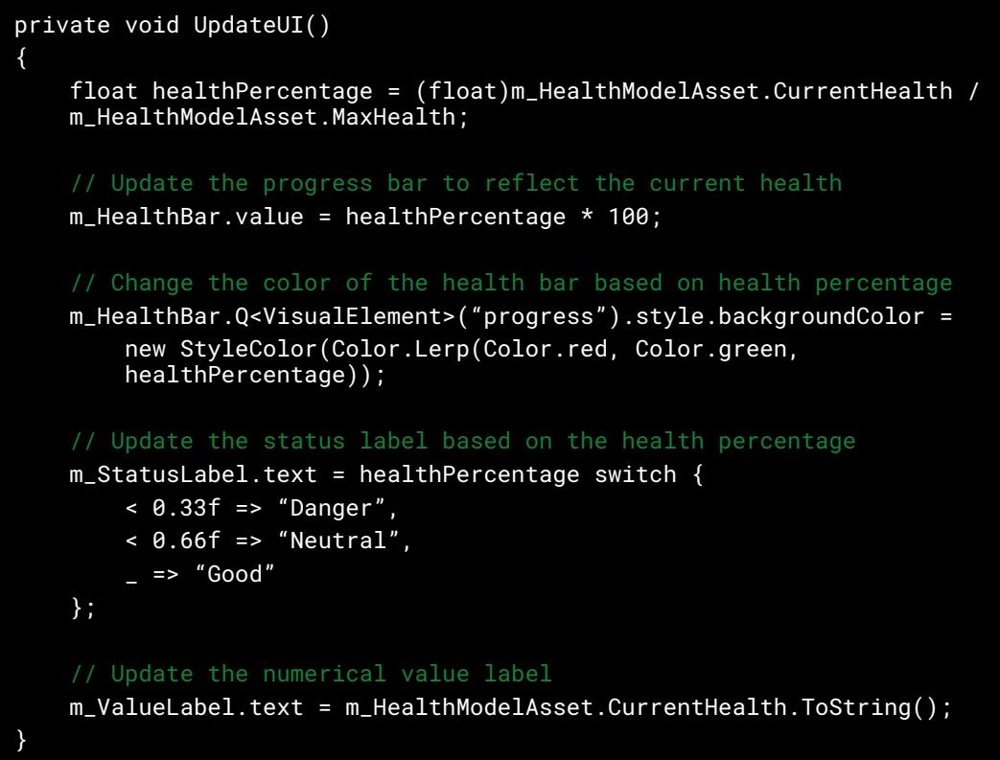

<span id="page-107-0"></span>UpdateUI calculates the ProgressBar value, changes its fill bar's background color, and updates both Labels. The logic converts the integer value into a string message or color as necessary for each element.

It's important to note that the HealthPresenter needs to subscribe to events from the HealthModel to trigger the UpdateUI method when the CurrentHealth value changes.

Any data outside of the UpdateUI method, such as the LabelName, is only initialized once at the start and does not update automatically when the CurrentHealth changes.


Sample health interface using MVP

In the sample project, click the target to damage the health bar or reset the health with the button. These UI elements inform the HealthPresenter (which invokes ApplyDamage or ResetHealth) rather than change the Health directly.


If you are using Unity UI, you can also find an older version of the sample scene that supports UGUI. Explore the **MVP** scene within the **7\_MVP** directory. Just remember to disable the SceneBootstrapper before accessing the Unity scene.

### <span id="page-108-0"></span>Pros and cons

MVP (and MVC) really shine for larger applications. If your game requires a sizable team to develop and you expect to maintain it for a long time after launch, you might benefit from the following:

— **Smooth division of work:** Because you've separated the View from the Presenter, developing and updating your user interface can happen nearly independently from the rest of the codebase.

This lets you divide your labor between specialized developers. Do you have expert front-end developers on your team? Let them take care of the View. They can work independently from everyone else.

- **Simplified unit testing with MVP and MVC:** These design patterns separate gameplay logic from the user interface. As such, you can simulate objects to work with your code without actually needing to enter Play mode in the Editor. This can save considerable amounts of time.
- **Readable code that can be maintained:** You'll tend to make smaller classes with this design pattern, which makes them easier to read. Fewer dependencies usually means fewer places for your software to break and fewer places that might be hiding bugs.

Though MVC and MVP are widespread in web development or enterprise software, often, the benefits won't be apparent until your application reaches a sufficient size and complexity. You'll need to consider the following before implementing either pattern in your Unity project:

- **You need to plan ahead:** Unlike the other patterns described in this guide, MVC and MVP are larger architectural patterns. To use one of them, you'll need to split your classes by responsibility, which takes some organization and requires more work up front.
- **Not everything in your Unity project will fit the pattern:** In a "pure" MVC or MVP implementation, anything that renders to screen really is part of the View. Not every Unity component is easily split between data, logic, and interface (e.g., a MeshRenderer). Also, simple scripts may not yield many benefits from MVC/MVP.

You'll need to exercise judgment where you can stand to benefit the most from the pattern. Usually, you can let the unit tests guide you. If MVC/MVP can facilitate testing, consider them for that aspect of the application. Otherwise, don't try to force the pattern onto your project.

## <span id="page-109-0"></span>Model-View-ViewModel

While MVP applies separation of concerns to our project, much of what the presenter does is simply shuttle data between the model and the view. This amounts to a lot of boilerplate code for data processing.

Consider the previous scenario where you have a player statistic, such as health. We can represent this value in a number of ways in the UI. For instance, the health value could display colors (green for full health, red for near death) or a warning message when health is low.

In MVP, the presenter would need to query the interface and then set up some logic to update each UI element as needed. In most cases, the presentation layer is simply serving up the existing data, formatting and preprocessing it for the view. Automating this can simplify our workflow.


The MVVM pattern.

### <span id="page-110-0"></span>MVVM in Unity 6

Thus, Unity 6 includes a runtime data binding system, which upgrades the MVP pattern to the [Model-View-ViewModel](https://en.wikipedia.org/wiki/Model%E2%80%93view%E2%80%93viewmodel) (MVVM) pattern. Similar to MVP, MVVM also consists of three main parts:

- **Model:** The Model represents the data and business logic of the application. This can be any object, often taking the form of a ScriptableObject or MonoBehaviour.
- **View:** The View is the user interface that displays the data and interacts with the user. In UI Toolkit, this usually consists of a UXML file along with a USS style sheet.
- **View model**: Much like the presenter from MVP, the View Model acts as a mediator between the Model and the View. This is commonly implemented as a MonoBehaviour.

Seems familiar? It should be. MVVM is from the same family of MVC design patterns. The key difference is that MVVM adds **data binding** (see below). Data binding makes updating the view more automatic when the model's properties change. This simplifies and reduces much of the repetitive code to sync the underlying data with the user interface.

## Data binding

[Data binding](https://docs.unity3d.com/6000.0/Documentation/Manual/UIE-data-binding.html) ensures synchronization between the properties of non-UI objects (like a string property on a MonoBehaviour) and UI elements (such as the value property of a TextField). A binding is essentially a link between a non-UI property and the UI element that modifies it.

Setting up bindings automatically synchronizes changes between the underlying data and the corresponding visual element. This eliminates the need to write event handlers manually for each UI update.

UI Toolkit in Unity 6 now supports [runtime data binding](https://docs.unity3d.com/6000.0/Documentation/Manual/UIE-runtime-binding.html). This feature allows for binding properties of C# objects to UI control properties during runtime UI operations. You can also use it in the Editor UI as long as it's not for serialized data.

### <span id="page-111-0"></span>Example: Updated sample project

The demo scene takes the same health bar example from the MVP sample scene and rebuilds it using the MVVM with UI Toolkit's runtime data binding.

Just like in the MVP example, the scene includes interactive elements to update a target's health bar. Clicking the collider damages the target, while clicking the button in the lower right resets its health.


The MVVM sample scene.

Adapting the same health bar example from the MVP sample scene illustrates the differences between the design patterns:

The HealthModel again is a ScriptableObject that contains a field for the CurrentHealth and some basic methods to increment, decrement, and reset its value. It also adds some extra data converters used for data binding but is otherwise identical.

The HealthView remains nearly unchanged, with the same UXML and HealthBar style sheet.

The HealthViewModel again acts as a mediator between the model and the view. However, much of the logic used to update the UI has been offloaded to UI Toolkit's runtime data binding. The scripted component again sets up the button interactivity and demonstrates how to replicate the data binding in C#.

<span id="page-112-0"></span>

Note how the data binding between the UI and the HealthModel ScriptableObject updates:

- The **Label Name** binds to the UI Label on the left. Modifying the field automatically updates on-screen.
- The value of the **Current Health** field appears on the Label to the right. As the value changes, the text updates automatically.
- A status Label's text property indicates "Good," "Neutral," or "Danger" based on the CurrentHealth value. The color of this label interpolates between green and red accordingly.
- The color of the progress bar updates to match. This demonstrates how to set up data binding through the HealthViewModel script.

By leveraging data binding, the MVVM pattern simplifies synchronizing the model with the view.

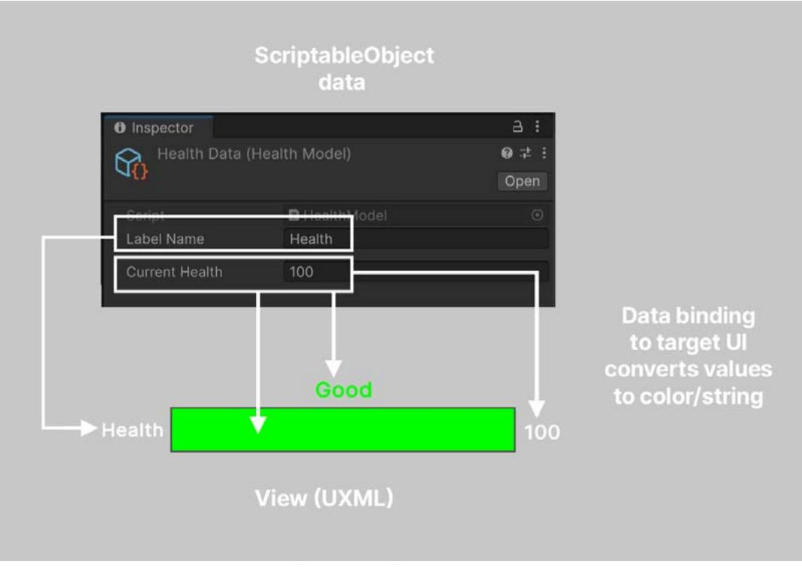

The UI binds to the HealthModel ScriptableObject's values.

#### **Data binding: UI Builder**

Let's take a look at setting up a basic example of data binding using UI Builder. If the UI needs to convert data directly from a ScriptableObject, this binding often can be done without the need for a separate script.


To prepare the HealthModel, we can add a static method with the InitializeOnLoadMethod attribute. The RegisterConverters adds a ConverterGroup (named "Int to HealthBar" in this example) that can transform integer values representing health into a color (from green to red) or string representations ("Danger," "Neutral," or "Good"). These can provide visual or textual feedback.

Here is how you can implement this:

```
[InitializeOnLoadMethod]
public static void RegisterConverters()
{
 var converter = new ConverterGroup("Int to HealthBar");
 converter.AddConverter((ref int value) =>
 new StyleColor(Color.Lerp(Color.red, Color.green, value /
 (float)k_MaxHealth)));
 converter.AddConverter((ref int value) =>
 {
 float healthRatio = (float)value / (float)k_MaxHealth;
 return healthRatio switch
 {
 >= 0 and < 1.0f / 3.0f => "Danger",
 >= 1.0f / 3.0f and < 2.0f / 3.0f => "Neutral",
 _ => "Good"
 };
 });
 ConverterGroups.RegisterConverterGroup(converter);
}
```
Then, you can open the UXML in UI Builder and apply data binding interactively:

- Locate the UI elements that you want to bind to the property. In the sample project, we bind the CurrentHealth to the status label and value label.
- Right-click to choose **Add binding…** from the context menu (or **Edit binding…** if a binding already exists).

| Focusable                                               |  |
|---------------------------------------------------------|--|
| Language Directi Inherit<br>Editor Binding Pa           |  |
| Good<br>Text<br>Add binding                             |  |
| Unset<br>Unset all                                      |  |
| Selectable<br>Select Word By C ✓<br>Select Line By Tr ✔ |  |

Add a data binding to a property in the Inspector

— Then, in the Add Binding window, select a **Data Source**, **Data Source Path**, and **Binding Mode**.

For example, in the status label, the Data Source is the **HealthData** asset. The Data Source Path is the **CurrentHealth** property. The BindingMode uses the **To Target** setting, meaning that the data binds only one-way from the source to the UI (i.e. the UI changes to reflect the data, not vice versa)

| Edit Binding                                |                                          | Y           |
|---------------------------------------------|------------------------------------------|-------------|
| Property<br>Type                            | text<br>Default                          | string<br>A |
| Data Source                                 | Object<br>G HealthData (Health Model)    | Type<br>0   |
| Data Source Path<br>Binding Mode            | CurrentHealth<br>To Target               | D           |
| Advanced Settings<br>Update Trigger         | On Source Changed                        | A           |
| Local converters<br>To target property (UI) | Int to HealthBar<br>Enter a converter ID |             |
| To data source                              | List Is empty<br>Enter a converter ID    |             |
|                                             |                                          | Close       |

The Edit Binding window.

— Open the **Advanced Settings** if you want to choose a specific converter from the ScriptableObject.

Here, the local converter uses the **"Int to HealthBar"** ConverterGroup, created in the HealthModel ScriptableObject.


A data binding icon appears in the UI Builder's Inspector once the setup is complete.

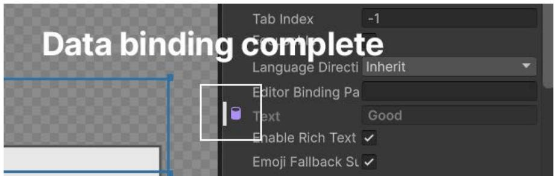

The data binding appears in the Inspector.

Once the data binding is in place, the user interface just works without additional code. Compare this simplified workflow with the HealthPresenter from the MVP sample scene.

Click the target to damage the CurrentHealth.The progress bar and labels update immediately to reflect the new value.

Open the UXML in a text editor to reveal what's happening behind the scenes. Each element that is set up with a data binding has a Binding block, containing all of the information set in UI Builder.


Data bindings appear as code blocks in the UXML.

For example, the Label named health-bar\_\_status-label above the health bar converts the CurrentHealth to the appropriate string and color; these values then bind to the "text" and "style.color" properties.

<span id="page-116-0"></span>

#### **Data binding: Scripting**

In some cases, you may need to set up data binding using C# instead of the UI Builder. This is useful when certain UI elements contain internal parts or sub-elements. For example, the ProgressBar's background and fill bar are not directly selectable in the UI Builder's Inspector.

This snippet demonstrates how to set up data binding in the HealthViewModel script:

```
private void SetDataBindings()
{
 var healthBar = m_Root.Q<ProgressBar>("health-bar");
 var healthBarProgress = healthBar?.Q<VisualElement>(className:
 "unity-progress-bar__progress");
 if (healthBarProgress != null)
 {
 healthBarProgress.dataSource = m_HealthModelAsset;

 var binding = new DataBinding
 {
 dataSourcePath = new PropertyPath(nameof(HealthModel
 .CurrentHealth)),
 bindingMode = BindingMode.ToTarget,
 };
 binding.sourceToUiConverters.AddConverter((ref int value) =>
 new StyleColor(Color.Lerp(Color.red, Color.green,
 (float)value / m_HealthModelAsset.MaxHealth)));

 healthBarProgress.SetBinding("style.backgroundColor", 
 binding);
 }
}
```
The SetDataBindings method queries the VisualElement hierarchy to find the ProgressBar named "health-bar." Then, it sets up the data binding much like in the UI Builder.

- Set the data source. In this case, the data source is the HealthData ScriptableObject asset in the project.
- Create a data binding object, which contains the dataSourcePath and the binding mode.
- Define data converters if necessary. The above example shows how the integer value can convert into a StyleColor on the ProgressBar's fill bar.

Then, call SetBinding on the UI element, passing in the property (e.g. "style. backgroundColor" for the ProgressBar's fill color) and the binding object. Repeat this process for each element property that needs data binding.


This becomes particularly important when direct binding to a ScriptableObject asset isn't possible, like when you need to create a ScriptableObject instance at runtime. In cases where a GameObject with a HealthViewModel must reference its individual health object, set up the data binding via scripting instead of the UI Builder.

Compare using data binding with the previous MVP example without it. Each uses the same UXML and USS.

| No data binding (MVP)                                                            | Data binding (MVVM)                                                                                    |
|----------------------------------------------------------------------------------|--------------------------------------------------------------------------------------------------------|
| The HealthPresenter listens for events<br>on the HealthModel in order to update. | The HealthModel registers a<br>ConverterGroup to transform model<br>data into a format used by the UI. |
| The HealthPresenter converts                                                     |                                                                                                        |
| values for display in the UI Elements                                            | The HealthViewModel creates                                                                            |
| (UpdateUI).                                                                      | bindings from the HealthModel to the UI                                                                |
|                                                                                  | (SetDataBindings).                                                                                     |
| The HealthModel stores data and basic                                            |                                                                                                        |
| business logic (Increment, Decrement).                                           | The HealthModel stores data and basic<br>business logic (Increment, Decrement).                        |


<span id="page-119-0"></span>

In MVP, the Presenter subscribes to events from the Model to detect state changes. When notified of a change, the Presenter processes the data into a format suitable for the View and updates the View accordingly.

In MVVM, start by registering any necessary Converters in the Model. Then, establish data bindings in the ViewModel. This setup allows changes in the Model to update the View automatically through the existing bindings.

You can find a more detailed introduction to runtime data binding in the [documentation.](https://docs.unity3d.com/6000.0/Documentation/Manual/UIE-get-started-runtime-binding.html)

#### Pros and cons

MVVM shares many of the benefits of MVP, such as improved testability and separation of concerns. Data binding can reduce the amount of boilerplate code needed to keep the UI in sync with the underlying data, reducing the number of events raised from the model. This leads to more concise code that is easier to read and maintain. It also improves UI consistency, with data binding reducing the risk of displaying stale or incorrect data.

However, consider the additional overhead of setting up each data binding. Setting the data source, data source path, binding mode, converters, etc. requires slightly more effort up front. This pattern may only be suitable for larger user interfaces where the benefits outweigh the additional complexity cost.

# <span id="page-120-0"></span>Strategy pattern

Gameplay seldom sits still. At runtime, your game objects often need to adapt to changing conditions and update themselves accordingly.

For example, imagine a stealth game where a player's movement style needs to switch between sneaking past guards to running away after being detected. Or consider a combat system where characters can exhibit different attack modes, such as melee, ranged, or magic.

Implementing these dynamic behaviors in a clean and maintainable way can be challenging as your game grows. Much as with the state pattern, using a switch statement can lead to large bloated classes.

The **[strategy](https://en.wikipedia.org/wiki/Strategy_pattern)** pattern offers a solution to this problem by wrapping algorithms or behaviors within an object and making them interchangeable. Each strategy object encapsulates a distinct behavior that can be executed dynamically. Thus, a client object can switch its behavior at runtime by referencing different strategy objects, without needing to modify its own class structure.

<span id="page-121-0"></span>

The Strategy pattern makes behaviors interchangeable at runtime.

### Example: An ability system

Imagine you're developing a game that allows players to acquire new abilities as they progress. For instance, these abilities could serve as rewards or "perks" for outstanding performance in a competitive FPS or action RPG. When a player becomes eligible for a new ability, a corresponding UI button might be displayed on the screen to indicate its availability.

#### **Before refactoring**

Initially, you might create a single script tasked with handling all special abilities. This approach works but as you need to add new abilities or modify existing ones, it becomes difficult to maintain.


The initial setup for defining these abilities might look something like this:

```
public class AbilityRunner : MonoBehaviour
{
 public enum Ability
 {
 RadarPulse,
 AirSupport,
 FirstAid
 }
 public Ability currentAbility;
 void Update()
 {
 if (Input.GetKeyDown(KeyCode.Space))
 {
 ActivateAbility(currentAbility);
 }
 }
 void ActivateAbility(Ability ability)
 {
 switch (ability)
 {
 case Ability.RadarPulse:
 // Radar Pulse logic
 Debug.Log("Activating Radar Pulse");
 break;
 case Ability.AirSupport:
 // Air Support logic
 Debug.Log("Calling in Air Support");
 break;
 case Ability.FirstAid:
 // First Aid/Healing logic
 Debug.Log("Using First Aid");
 break;
 }
 }
}
```
<span id="page-123-0"></span>

This script becomes increasingly complex and challenging to manage as the game evolves. Each new ability requires modifications to the existing code, violating the open-closed principle. Remember that our goal is to keep our software open for extension but closed for modification.

#### **Implementing the strategy pattern**

Let's revisit the ability system using the strategy pattern. Begin by creating an abstract Ability class or interface. This will define a method called Use that all specific abilities must implement. This example extends ScriptableObject (but any object can work here).


Then, create concrete implementations of the Ability class for each specific ability. These classes will implement the actual logic within the Use method to perform their unique actions.

```
[CreateAssetMenu(fileName = "RadarPulseAbility", menuName = "Abili-
ties/RadarPulse")]
public class RadarPulse : Ability
{
 public override void Use(GameObject gameObject)
 {
 Debug.Log("Activating Radar Pulse");
 // Implement Radar Pulse logic here
 }
}
[CreateAssetMenu(fileName = "AirSupportAbility", menuName = "Abili-
ties/AirSupport")]
public class AirSupport : Ability
{
 public override void Use(GameObject gameObject)
 {
 Debug.Log("Calling in Air Support");
 // Implement Air Support logic here
 }
}
[CreateAssetMenu(fileName = "FirstAidAbility", menuName = "Abilities/
```


These ScriptableObjects can be serialized and stored as project assets. This allows them to be easily assigned and modified within the Unity Inspector.

A client object can then reference these strategy objects. Here, we refactor the AbilityRunner class so that at runtime, it can set its specific currentAbility dynamically. In this example, pressing the Space key calls the Use method, which executes the ability logic.

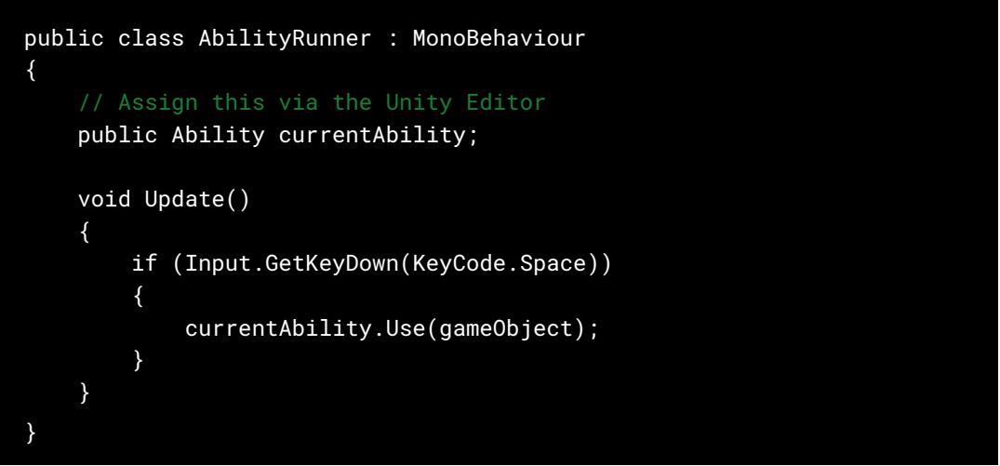

Each ability, now encapsulated as its own object, can be edited, added, or removed without impacting the core game code. This enhances the game's flexibility, allowing for dynamic ability changes at runtime. Creating new abilities also becomes more manageable and scalable as a result.

<span id="page-125-0"></span>

#### Example: Sample project

The project shows a basic implementation of the strategy pattern. The player can gather power-ups to attain a desired "streak." The button updates according to the streak count, displaying different abilities as the player streak increments. Clicking the button then activates the current special ability as a strategy.

What the button actually does is wrapped into a ScriptableObject. That means that it can be interchanged at runtime, either in the Inspector or with separate game logic.

In this specific sample, a streak counter ties the associated perk or special ability to the UI, which dynamically adjusts to player performance.

Because each interchangeable strategy is encapsulated in its own class, adding more abilities does not impact the others; simply create more ScriptableObject abilities as your game requires.

Here, the button triggers some decorative elements (such as a particle effect or sound), but it's not limited to any one thing.

Each encapsulated strategy can perform a vast range of actions tailored to your game's specific needs. Alter gameplay mechanics, enhance character abilities, or even modify the game environment.


The project implements special abilities, or perks, using the strategy pattern.

<span id="page-126-0"></span>

#### Pros and cons

The strategy pattern works well for situations where you need to change how your game behaves at runtime. Because you can add new features without altering existing code, this pattern makes your system more flexible in keeping with SOLID principles. Each behavior is neatly compartmentalized into its own class, and that makes testing easier as well.

On the downside, having more classes to manage can increase complexity. Because a strategy object carries a small amount of overhead with it, consider alternative patterns or optimizations when performance is critical.

Being encapsulated also means that you'll need to carefully design how these strategies will share information and communicate with the rest of your gameplay systems (e.g. events). You'll need to avoid tightly coupling the strategies with other components; otherwise, you're negating the benefits of the pattern.

#### More examples

The strategy pattern is not just a tool for managing abilities. You can apply it to many different aspects of gameplay. Here are a few practical examples:

**Character movement strategies:** Imagine you're creating a platformer game where the player character's movement abilities can be upgraded, depending on the environment or power-ups. At the start, the player might only be able to walk and jump, but later they gain the abilities to double-jump, dash, or even fly.

**AI behavior:** Switch between different AI behaviors based on the game state or player actions. Adjust enemy states between offensive, defensive, or patrol strategies, depending on the player.

**Navigation strategies**: If you created a pathfinding system, you could use the strategy pattern to define multiple algorithms (A\*, Dijkstra's shortest path, etc.) that you could swap during gameplay, depending on context.

**Attack strategies:** Allow players or AI to switch between weapon types dynamically, with strategies such as MeleeAttack, RangedAttack, or AreaEffectAttack. Or imagine a boss enemy that can switch modes or unique combat abilities, depending on its remaining health.

**Difficulty Adjustment:** Automatically adjust game difficulty based on player performance. Implement an "adaptive difficulty" strategy that changes in real-time. Or allow the player to select a "fixed difficulty" strategy for a consistent challenge.

# <span id="page-127-0"></span>Flyweight pattern

Large game worlds will often contain scenes populated with numerous GameObjects and components. If similar objects carry the same data fields, this can result in significant duplication of data, leading to increased memory usage. Consider a forest scene where each tree object stores its own configuration data.

A tree in our game scene might store:

- Complex data structures for defining the tree. If you were generating the tree procedurally, this could include arrays or lists of floats, colors, and Vector3 values.
- Animation curves for defining how the tree sways in the wind.
- Custom class instances that define other physical characteristics or gameplay metadata.

Though each individual field may be relatively small, remember that duplicating the GameObject also copies its various components and their stored data fields. If a field is a value type (e.g., a struct, primitive type, or array), each duplicated GameObject will have its own copy of the data. Populate your game world forest with trees, and this redundancy quickly adds up.

The flyweight is an optimization pattern that can reduce the amount of duplicate data in your game by centralizing shared data. Thus, it allows individual objects to reference this shared data instead of storing their own copies.

<span id="page-128-0"></span>

Use the Flyweight pattern to share data across similar objects.

If you're accustomed to the prefab workflow in Unity, then you're already familiar with the idea. We can share as much data as possible between similar objects, reducing the overall memory footprint.

#### Unrefactored example

Consider a strategy game teeming with gameplay units. Each may carry attributes such as health, attack, defense, and movement. To identify each unit, you also might want to tag them with a team label and icon.

Thus, an unoptimized gameplay unit might have a class like this:

```
public class UnrefactoredUnitInstance : MonoBehaviour
{
 public string factionName;
 public Sprite factionIcon;
 public int baseHealth;
 public int baseAttack;
 public int baseDefense;
 public int baseMovement;
 // Unique state for this unit instance
 public int health;
 public int attack;
 public int defense;
 public int movement;
 public Vector3 position;
```


```
 private void Start()
 {
 RefreshUnitStats();
 }
 private void RefreshUnitStats()
 {
 health = baseHealth;
 attack = baseAttack;
 defense = baseDefense;
 movement = baseMovement;
 // ... update other unit components based on faction data
 }
 public void SetFactionData(string factionName, Sprite factionIcon, 
 int baseHealth, int baseAttack, int baseDefense, int baseMovement)
 {
 this.factionName = factionName;
 this.factionIcon = factionIcon;
 this.baseHealth = baseHealth;
 this.baseAttack = baseAttack;
 this.baseDefense = baseDefense;
 this.baseMovement = baseMovement;
 RefreshUnitStats();
 }
}
```
In addition to its own stats, a unit carries an additional payload of data that should ideally remain constant across a given faction or team. When creating a new unit instance with the SetFactionData method, you pass all the common faction data – and store a copy of it. The more units you add, the more redundant data you're duplicating and storing.

This doesn't just use up more memory – it also makes it harder to keep everything updated and consistent across your game. Manually syncing data across many objects is error prone and can lead to inconsistencies.

With a handful of objects, it's not a problem. But with a large number of units from the same faction, the increased memory usage may start to be noticeable – or at least difficult to manage.

### <span id="page-130-0"></span>Implementing the flyweight pattern

A simple solution is to store the shared data in a central repository, or **flyweight** object.

A ScriptableObject works well for this purpose since it's ideal for storing data that doesn't need to change at runtime (e.g. settings, configuration data, etc.).

Refactoring the shared data into a separate class can reduce redundancy, like so:

```
// Flyweight object (ScriptableObject)
[CreateAssetMenu]
public class FactionData : ScriptableObject
{
 public string factionName;
 public Sprite factionIcon;
 public int baseHealth;
 public int baseAttack;
 public int baseDefense;
 public int baseMovement;
}
// Context object
public class UnitInstance : MonoBehaviour
{
 public FactionData factionData;
 private void Start()
 {
 RefreshUnitStats();
 }
 private void RefreshUnitStats()
 {
 health = factionData.baseHealth;
 attack = factionData.baseAttack;
 defense = factionData.baseDefense;
 movement = factionData.baseMovement;
 // ...Update other unit components based on faction data
 }
 // Unique state for this unit instance
 public int health;
 public int attack;
 public int defense;
 public int movement;
 public Vector3 position;
 // ... Add other unique states here
}
```
<span id="page-131-0"></span>Using the pattern, the FactionData class is a ScriptableObject that represents the shared faction data. It contains fields for the faction name, icon, and base unit stats.

The UnitInstance class is the Context object that holds a reference to the FactionData ScriptableObject. It refreshes its stats based on the shared faction data. By separating shared and unique data, you reduce memory usage and potential inconsistencies across your game objects.

#### Example: Sample project

The provided example demonstrates the flyweight pattern by optimizing memory usage for a fleet of spaceships.

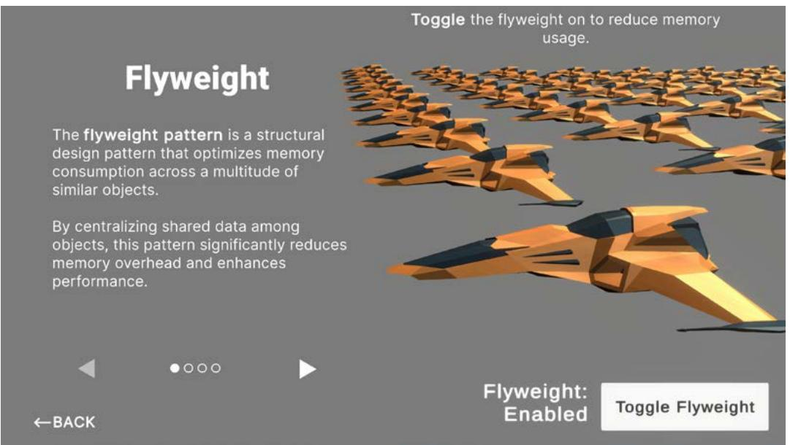

Share data across similar objects using the flyweight pattern.

The core principle is distinguishing between intrinsic (shared) and extrinsic (unique) state data. Intrinsic data is immutable and shared across instances, reducing memory usage. Extrinsic data varies between instances and is stored individually.

In the example**, ShipData** is a ScriptableObject that contains intrinsic, shared data for all ships, such as unit name, speed, attack power, and defense. All ships reference the same data set for these properties, minimizing the memory footprint.


```
[CreateAssetMenu(fileName = "ShipData", menuName = "Flyweight/ShipDa-
ta", order = 1)]
public class ShipData : ScriptableObject
{
 public string UnitName;
 public string Description;
 public float Speed;
 public int AttackPower;
 public int Defense;
}
```
Create the ScriptableObject instance from the context menu defined in the CreateAssetMenu attribute.

A Ship class can represent individual ships in the fleet. Each ship instance holds a reference to the shared ShipData and, in turn, manages its own unique state, such as health.

```
public class Ship : MonoBehaviour
{
 [SerializeField] private ShipData m_SharedData;
 [SerializeField] private float m_Health;
 public void Initialize(ShipData data, float health)
 {
 m_SharedData = data;
 m_Health = health;
 }
 public void DisplayShipInfo()
 {
 Debug.Log($"Name: {sharedData.UnitName}, Health: {m_Health}");
 }
}
```
The ShipFactory is responsible for generating the fleet of ships. It initializes each ship using a prefab GameObject and the shared ShipData.

```
public class ShipFactory : MonoBehaviour
{
 [SerializeField] private Ship shipPrefab;
 [SerializeField] private ShipData sharedShipData;
 [SerializeField] private float spacing = 1.0f;
 void Start()
 {
 GenerateShips(10, 10);
 }
 public void GenerateShips(int rows, int columns)
 {
 for (int i = 0; i < rows; i++)
 {
 for (int j = 0; j < columns; j++)
 {
 Vector3 position = new Vector3(i * spacing, 0, j * 
 spacing);
 Ship newShip = Instantiate(shipPrefab, position,
 Quaternion.identity, transform);
 newShip.Initialize(sharedShipData, 100);
 // Assuming 100 is the starting healt
 newShip.name = $"Ship_{i * columns + j}";
 }
 }
 }
}
```
By centralizing shared data in a ScriptableObject, you can reduce the memory footprint across numerous ship instances. Meanwhile, unique data such as health is still managed individually by each ship instance.

Though this isn't much savings per GameObject, the efficiencies become more noticeable the more ships you add to the scene. Large numbers of similar objects make the best use of this pattern.

Add the [Memory Profiler](https://unity.com/how-to/use-memory-profiling-unity) package from the Package Manager to get better insight into the memory savings. In the Memory Profiler window (**Window > Analysis > Memory Profiler**) search through the managed objects to determine the allocated size. Compare before implementing the pattern versus applying the flyweight object.

<span id="page-134-0"></span>

| O Memory Profiler<br>Capture · Editor ·                                                                                                                                                                                                                   |                                                                                                                                                                                                                                                                                                                                   |                                                           |                                                                 |   |
|-----------------------------------------------------------------------------------------------------------------------------------------------------------------------------------------------------------------------------------------------------------|-----------------------------------------------------------------------------------------------------------------------------------------------------------------------------------------------------------------------------------------------------------------------------------------------------------------------------------|-----------------------------------------------------------|-----------------------------------------------------------------|---|
| 0<br>Single Snapshot Compare Snapshots                                                                                                                                                                                                                    | Summary<br>Unity Objects<br>All Of Memory                                                                                                                                                                                                                                                                                         |                                                           |                                                                 | 0 |
| Refactor<br>Allenovation<br>2024-03-18 17<br>an de la personale de la provinsi de la provinsi de la provinsi de la provinsi de la provinsi de la provinsi de la provinsi de la provinsi de la provinsi de la provinsi de la<br>1 UDSSBS<br>DesignPatterns | A breakdown of all tracked memory that Unity Knows about. Allocated Memory                                                                                                                                                                                                                                                        |                                                           | · 9 Ship                                                        |   |
| A<br>65                                                                                                                                                                                                                                                   | Allocated Memory In Table: 25.5 KB                                                                                                                                                                                                                                                                                                |                                                           | Total Memory In Snapshot: 3.00 GB                               |   |
| Total Resident: 1.70 GB<br>Close<br>Hardware Resources: 15.76 GB                                                                                                                                                                                          | Description<br>> Native                                                                                                                                                                                                                                                                                                           | Allocated Size<br>16.0 KB                                 | % Impact                                                        |   |
| No snapshot selected.                                                                                                                                                                                                                                     | y Managed<br>V Managed Objects (6 Items)<br>DesignPatterns.Flyweight.Ship (101 (101 (tems)<br>System.String (28 Items)<br>> DesignPatterns.Flyweight.UnrefactoredShipFactory (1 Itel 96 B<br>DesignPatterns.Flyweight.UnrefactoredS<br>hip (1 Rem)<br>DesignPatterns.Flyweight.ShipFactory<br>Item)<br>Onttorne Chausiant ChinDat | 9.5KB<br>9.5 KB<br>63 KB<br>28 KB<br>80 8<br>72 B<br>72 B |                                                                 |   |
| Session 1- DesignPatterns<br>A<br>Refactor<br>2024-03-18 17:04:27<br>15.76 GB<br>1.70 GB<br>Unrefactor<br>2024-03-18 17:04:50<br>1. 4 GB<br>15.76 GB                                                                                                      | Description<br>Managed<br>Managed Objects (3 Items)<br>> DesignPatterns.Flyweight.UnrefactoredShip   [0]     ems]<br>> System.String (5 Items)<br>DesignPatterns.Flyweight.UnrefactoredShipFactory [1 Itel 96 B                                                                                                                   | Allocated Size<br>8.3 KB<br>83 KB<br>7,9 KB<br>342 B      | The Flyweight can<br>reduce memory usage for<br>similar objects |   |

Compare the memory savings in the Memory Profiler.

While the sample scene only showcases a few shared fields, the flyweight pattern's benefits can become substantial in large-scale projects like RPGs or strategy games with numerous onscreen units.

Use the flyweight pattern to save resources whenever you have a large number of objects that share common properties in their base classes.

## Prefabs versus flyweights

The prefab system can be considered an implementation of the flyweight pattern, but with differences in approach and scope.

- Prefabs share entire GameObject structures, including all components and hierarchies, while the flyweight pattern allows selectively sharing specific data fields or properties.
- The flyweight pattern provides more flexibility in separating and managing shared data because it's not tied to a specific GameObject structure.

While prefabs are well-suited for reusing complex GameObjects, flyweights provide additional optimization when numerous objects share just a subset of properties. The two approaches can complement each other, with prefabs handling overall structure reuse and flyweights optimizing shared data fields within those structures.

### <span id="page-135-0"></span>Pros and cons

The flyweight pattern excels in scenarios where numerous objects share a common state. This is particularly useful on resource-constrained platforms, such as mobile devices, where reducing memory consumption can improve performance. Applications that require instantiating a large number of objects can use the flyweights to their advantage to scale more effectively.

Just be aware that the pattern incurs additional overhead and complexity. In addition to managing the individual objects in your scene, you'll also need to manage their shared state. The benefit from the flyweight pattern only becomes tangible when there are a sufficient number of units to justify the additional overhead.

Also, because you're forcing units to share the same basic data, that limits their flexibility. You'll need to override the shared data to make each unit unique, akin to the prefab workflow but applied to specific data sets.

#### More examples

Though much of what the flyweight pattern provides can also be achieved using prefabs, it can be a good choice for the following types of cases:

**Crowd simulations**: Building a sports sim with some background crowds? Use the pattern to share models, animations, and textures to build large, dynamic crowds.

**Character/weapon skins and customization:** Many games often allow players to customize their weapons or gear with skins and attachments. The base properties of these items can be shared with flyweights, with only the customizations stored individually.

**Level art:** When designing a forest, take all of the universal properties of a tree and store them in the base Tree class. Then, you don't need to repeat them in the subclasses (e.g., PineTree, MapleTree, and so on).

Note that in scenarios where your game features thousands of objects with shared data (such as a swarm of projectiles in an intense shooter or armies of units in an action strategy game), consider using Unity's [Data-Oriented Technology Stack](https://github.com/Unity-Technologies/EntityComponentSystemSamples) (DOTS) instead. DOTS can offer superior performance optimization through its focus on multithreading and reducing data dependencies. Read the [DOTS e-book for advanced Unity developers](https://unity.com/blog/engine-platform/new-ebook-understanding-unity-dots) for an in-depth look at each of the packages and technologies in the stack and their related concepts.

As with any design pattern, evaluate the specific needs of your project before implementing it. Then, decide as a team which pattern will give the best benefit.

# <span id="page-136-0"></span>Dirty flag

Sometimes game development starts to get complicated – or at least computationally expensive. The **[dirty flag](https://gameprogrammingpatterns.com/dirty-flag.html)** pattern can help when you have a lot of calculations or updates happening in your scenes.

A dirty flag is simply a boolean that indicates whether an object's state has changed since the last time it was processed or rendered. If an object is "dirty," it gets updated; otherwise, it's skipped, saving computational resources.

A common use case is traversing a complex hierarchy or managing a large scene file. The dirty flag can help minimize calculations until certain objects are marked "dirty." For example, child transforms could ignore updates until the parent or root transform requires one. This can help minimize unnecessary calculations with dynamic objects that frequently change state.

Using the dirty flag pattern means strategically placing checks at points where object states are likely to change. This could be within event handlers, physics updates, or animation systems. The checks then ensure that only a subset of the game world is updated in response to player actions or game events. Every resource saved helps reduce overhead.

<span id="page-137-0"></span>

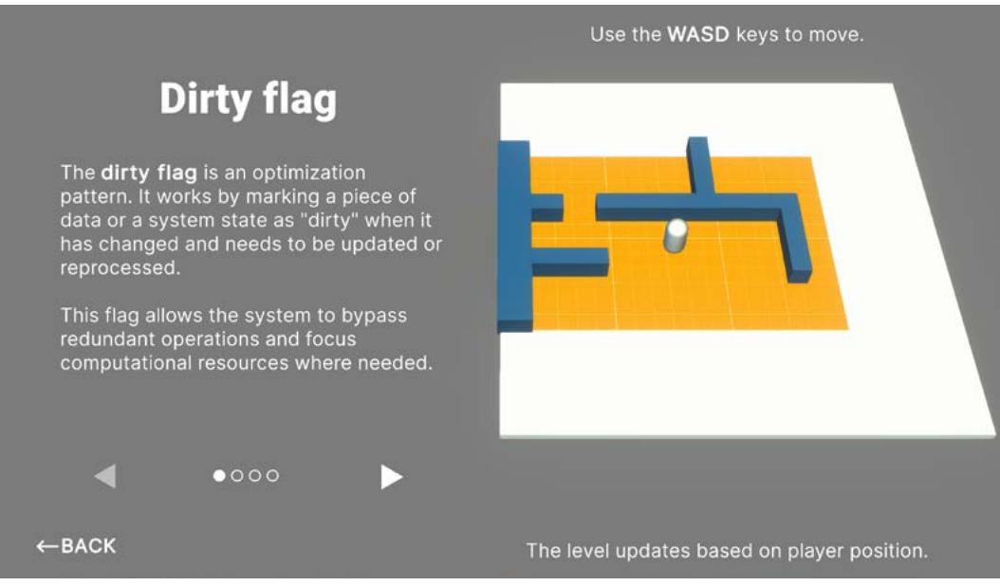

Use the dirty flag pattern to prevent unnecessary updates.

### Example: Sample project

Consider a large, open-world game. It's often resource-prohibitive to load the entire game environment at once. Instead, a common tactic is to load just a portion of the game world that the player currently sees.

To manage this, the game world can be divided into smaller Unity scenes, loading each one as necessary. However, this scene loading process is relatively slow and can cause brief pauses that disrupt gameplay.

Thus, we only want to update the game world when necessary. In this example, we introduce a mechanism that only executes when certain conditions are met. We mark the world with a dirty flag when it's ready for an update. Otherwise, the update loop skips over the expensive logic.

As the player navigates through the level, this game world only updates when the player moves near the boundary of the current sector. This saves compute resources to help ensure a seamless gameplay experience.

Explore the sample implementation to see one way to apply this pattern:

- The game world is divided into sectors or regions, each with associated content that needs to load when the player is nearby.
- A manager script tracks the player's movement and determines which sectors are relevant based on the player's current location.
- Each sector has a dirty flag that indicates whether its content needs to be loaded or unloaded, based on the player's proximity and interaction.


Because scene loading is a relatively expensive operation, the dirty flag pattern makes sure that the expensive game world update only runs when necessary. Here, the GameSectors script manages what parts of the game world loads at runtime.

```
public class GameSectors: MonoBehaviour
{
 public Player player;
 public Sector[] sectors;
 private void Update()
 {
 foreach (Sector sector in sectors)
 {
 bool isPlayerClose = sector.IsPlayerClose(player
 .transform.position);

 // Check if the sector's state needs to change
 If (isPlayerClose != sector.IsLoaded)
 {
 sector.MarkDirty();
 }
 // Update the sector based on its dirty flag
 if(sector.IsDirty)
 {
 If (isPlayerClose)
 {
 sector.LoadContent();
 }
 else
 {
 sector.UnloadContent();
 }
 // Reset the dirty flag
 sector.Clean(); 
 }
 }
 }
}
```
The sample scene illustrates how to visualize material changes and scene loading/unloading in response to the player's proximity. By using the dirty flag pattern, content loading and unloading operations are only performed when the player moves close enough to or far enough from a sector.


This minimizes unnecessary processing and memory usage as the application shows a limited section of the game world at a time.

Each Sector in this example maintains its own distance to the player as the threshold to load or unload assets. Here's a snippet of sample:

```
 public class Sector : MonoBehaviour
 {
 [Tooltip("Minimum distance to load")] 
 public float m_LoadRadius;
 ...
 public bool IsLoaded { get; private set; } = false;
 public bool IsDirty { get; private set; } = false;
 void Awake()
 {
 ...
 Clean();
 IsLoaded = false;
 }
 public void MarkDirty()
 {
 IsDirty = true;
 Debug.Log($"Sector {gameObject.name} is marked dirty");
 ...
 }
 public void LoadContent()
 {
 IsLoaded = true;
 ...
 // Logic to load scene content from the project
 }
 public void UnloadContent()
 {
 IsLoaded = false;
 ...
 // Logic to unload scene content 
 }
 public bool IsPlayerClose(Vector3 playerPosition)
 {
```


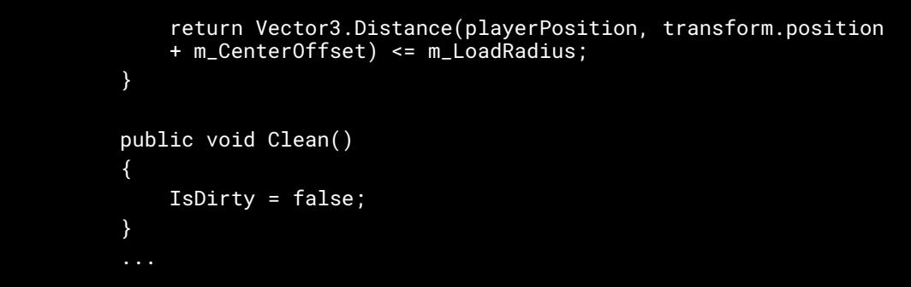

In this setup, a SceneLoader component selectively loads and unloads parts of the game as the player moves through the level.

The camera in the scene provides a top-down view to illustrate how this system works. In a real application, imagine a camera following the player, showing only a limited field of view. In this scenario, the game could then selectively load and display only those areas immediately within the player's visibility.

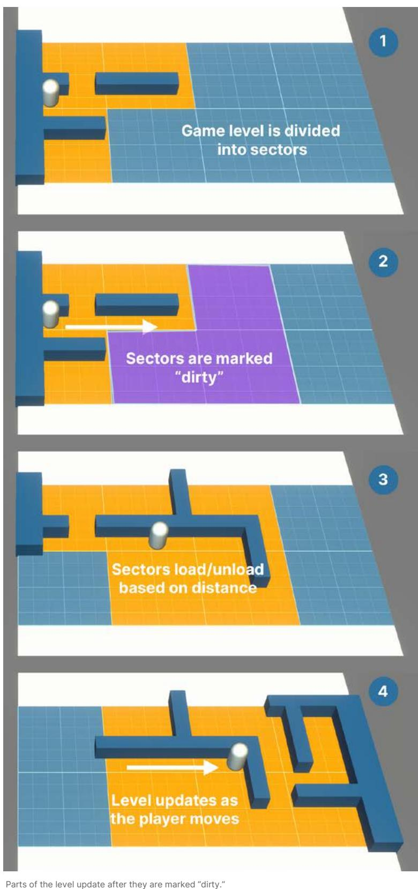

<span id="page-142-0"></span>Though we can further optimize this (and not use an Update at all), this example shows a simple case of using a dirty flag to reduce the expensive calls to the SceneManagement API.

#### Pros and cons

The dirty flag pattern is particularly valuable in large simulations or systems generating procedural content. Because costly operations only execute when needed, it minimizes unnecessary calculations and can boost memory efficiency – vital for platforms with limited memory like mobile devices.

On the negative side, be aware that the dirty flag can introduce tight coupling between components. This adds a layer of dependency and risk. Also, since updates are postponed until the dirty flag is set, the application's state might temporarily lag, appearing outdated until the necessary update occurs.

## Dirty flags versus dirty bits and caching

The terms "dirty bit" and "caching" are often mentioned alongside the dirty flag pattern. In computing, each serves a distinct purpose.

The dirty flag pattern is a high-level software design strategy aimed at reducing unnecessary updates in applications.

In contrast, a dirty bit is a low-level indicator used in systems programming to signal modified memory pages, requiring updates before being replaced.

The broader technique of caching improves data retrieval speed by storing temporary copies of data, often utilizing dirty flags or bits to ensure the cached data remains current.

#### More examples

Use the dirty flag whenever you want to minimize the impact of an expensive calculation or operation, such as in the following cases.

**Complex hierarchical transforms.** If you have child transforms of an animated character, minimize animations until the parent transform updates (e.g. only update the lower limbs if the upper limbs or body is moving). If you had a strategy game where the units are in formation, have the units update their motions only after the entire group formation is marked dirty.

**Physics simulations**: For physics simulations involving complex interactions or large numbers of objects, recalculate only when the state of the objects changes (like position, velocity, or external forces) in order to optimize performance.


**Pathfinding:** Recalculating paths for AI agents can be expensive. Using dirty flags to update paths only when obstacles move or the target location changes.

**Procedural Content Generation:** Much like the scene-loading example, this pattern can tell the system when to regenerate procedural terrain based on specific triggers like player movement or game events.

**UI Layouts:** In a complex UI system, elements might need to rearrange themselves when certain conditions change (like window resizing, content updates, etc.). The dirty flag pattern can be used to update the layout only when necessary, avoiding constant recalculations. For example, a VisualElement in UI Toolkit includes a [MarkDirtyRepaint](https://docs.unity3d.com/ScriptReference/UIElements.VisualElement.MarkDirtyRepaint.html) method. Likewise, the EditorUtility has [ClearDirty](https://docs.unity3d.com/ScriptReference/EditorUtility.ClearDirty.html) and [SetDirty](https://docs.unity3d.com/ScriptReference/EditorUtility.SetDirty.html) methods.

# <span id="page-144-0"></span>Conclusion

If you're new to software patterns, we hope this guide has helped you understand some of the most common ones you can encounter in Unity development.

Whether it's a factory for spawning Prefabs or a state pattern for AI, keep these techniques handy as the need arises. Recognizing when and how to apply design patterns can help you tackle your next Unity challenge. Of course, don't get lost in forcing a specific pattern to fit; not using a pattern is just as important as using one.

A design pattern can speed up your workflow and offer an elegant solution to a recurrent problem when applied correctly. Then, you can concentrate on what's important: making a fun and unique experience for your players.

So, while you don't need to reinvent the wheel, you can definitely put your own spin on it.

## <span id="page-145-0"></span>Other design patterns

This guide is just a small sampling of several well-known design patterns in computing and game development. While we won't go into their specifics, here's a brief overview of some others that may be useful to you:

- **[Adapter](https://en.wikipedia.org/wiki/Adapter_pattern)**: This provides an interface (also called a wrapper) between two unrelated entities so they can work together.
- **[Double buffer](https://gameprogrammingpatterns.com/double-buffer.html)**: This allows you to maintain two sets of array data while your calculations finish. You can then display one set of data while you process the other, which is useful for procedural simulations (e.g., cellular automata) or just rendering things to screen.
- **[Interpreter/Bytecode](https://gameprogrammingpatterns.com/bytecode.html)**: If you want to add modding support or allow nonprogrammers to extend your game, you can create a simplified language that users can edit in an external text file. The bytecode component can then translate that interpreted language into C# game code.
- **[Subclass sandbox](https://gameprogrammingpatterns.com/subclass-sandbox.html)**: If you have similar objects with varying behaviors, you can define those behaviors as protected in a parent class. Then the child classes can mix and match to create new combinations.
- **[Type object](https://gameprogrammingpatterns.com/type-object.html)**: If you have many varieties of a GameObject, instead of making subclasses for each one, define all possible behaviors in a single abstract or parent class. Differentiate the special characteristics of individual objects in a separate data file (such as a ScriptableObject) that can be customized without changing the code. For example, this allows you to create an inventory of seemingly different items that all derive from the same class. A game designer can customize the data file to make each item unique (e.g., weapons for an RPG), all without the assistance of a programmer.
- **[Data locality](https://gameprogrammingpatterns.com/data-locality.html)**: If you optimize data so that it's stored efficiently in memory, you can reap the rewards of performance. Replacing classes with structs can make your data more cache-friendly. Unity's [ECS and DOTS](https://unity.com/dots) architecture implement this pattern.
- **[Spatial partitioning](https://gameprogrammingpatterns.com/spatial-partition.html)**: With large scenes and game worlds, use special structures to organize your GameObjects by position. The [Grid](https://en.wikipedia.org/wiki/Grid_(spatial_index)), Trie ([Quadtree,](https://en.wikipedia.org/wiki/Quadtree) [Octree](https://en.wikipedia.org/wiki/Octree)), and [Binary search tree](https://en.wikipedia.org/wiki/Binary_search_tree) are all techniques to help you divide and search more efficiently.
- **[Decorator](https://en.wikipedia.org/wiki/Decorator_pattern)**: This allows you to add responsibilities to an object without changing its existing structure. A decorator could imbue special abilities or modify a GameObject, e.g., adding perks to a weapon without needing to change the base weapon class.
- <span id="page-146-0"></span>— **[Facade](https://en.wikipedia.org/wiki/Facade_pattern)**: This provides a simple, unified interface to a more complex system. If you have a GameObject with separate AI, animation, and sound components, you might add a wrapper class around those components (imagine a Player controller class managing PlayerInput, PlayerAudio, and so on). This facade hides details of the original components and simplifies usage.
- **[Template method](https://en.wikipedia.org/wiki/Template_method_pattern)**: This pattern defers the exact steps of an algorithm into a subclass. For example, you could define a rough skeleton of algorithm or data structure in an abstract class but allow the subclasses to override certain parts without changing the algorithm's overall structure.
- **[Composite](https://en.wikipedia.org/wiki/Composite_pattern)**: Use this structural design pattern to organize objects into tree structures and then treat the resulting structure like you would individual objects. You construct the tree from both simple and composite elements (a leaf and a container). Every element implements the same interface so you can run the same behavior recursively on the entire tree.

Note: All Wikipedia references in this e-book were made through a Creative Commons license: <https://creativecommons.org/licenses/by-sa/3.0/>. No Wikipedia authors cited herein have endorsed our work.

#### A series of advanced resources for Unity programmers

The programming design patterns guide is one in a series of resources we created for experienced Unity programmers. The other e-books in the series are:

- 1. [Create a C# style guide: Write cleaner code that scales](https://unity.com/resources/create-code-c-sharp-style-guide-e-book?isGated=false)
- 2. [Create modular architecture in Unity with ScriptableObjects](https://unity.com/resources/create-modular-game-architecture-with-scriptable-objects-ebook?isGated=false)

You can find all the e-books (and many how-to articles) in the Unity [best practices hub](https://unity.com/how-to) or via [the best practices page](https://docs.unity3d.com/Manual/best-practice-guides.html) in Unity documentation.


[unity.com](https://unity.com/releases/lts)